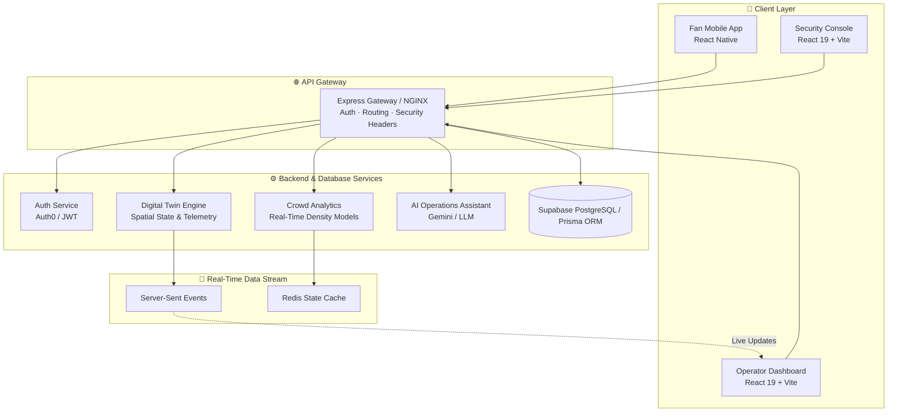
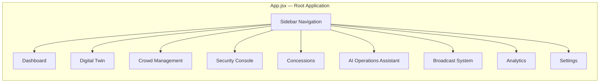
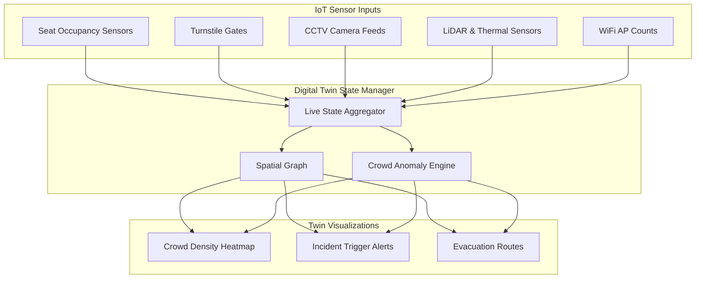

# 🏟️ StadiumGenius — Architecture & System Design

> **Version:** 1.0.0 · **Classification:** Master Architecture Specification  
> **Status:** Active Project Documentation (Vite + React + Express/FastAPI + Supabase)

---

## 1. Executive Summary

**StadiumGenius** is an AI-powered smart stadium operations platform designed for FIFA World Cup 2026 venues. It integrates Digital Twins, real-time IoT telemetry, 5G edge computing, and Generative AI (LLM) to deliver crowd management, security orchestration, fan navigation, and operational decision support.

---

## 2. System Context & Architecture Principles

| Principle | Description |
|---|---|
| **Event-Driven & SSE** | Telemetry flows continuously via Server-Sent Events (SSE) and WebSocket streams. |
| **Edge-Cloud Hybrid** | Safety-critical inference (crowd density, anomaly detection) executes near edge sensors with cloud fallback. |
| **Human-in-the-Loop** | AI incident recommendations require explicit operator validation before execution. |
| **Fail-Safe Defaults** | System degrades gracefully during network partitions or node dropouts. |
| **Zero-Trust Security** | Role-Based Access Control (RBAC), JWT authentication, and HTTPS/TLS encryption across all endpoints. |



---

## 3. Component Architecture & Code Organization

### 3.1 Frontend Architecture (React 19 + Vite 8)

The frontend is a modern SPA leveraging React 19, Vite, Tailwind CSS v4, Framer Motion, and Recharts.



### 3.2 Backend Directory Layout (`server/`)

```
server/
├── app/               # Application logic & services
├── db/                # Database configuration & Prisma ORM integration
├── middleware/        # Authentication, CORS, and rate-limiting middleware
├── routes/            # REST API route handlers (auth, venues, incidents, AI, analytics)
├── tests/             # Automated integration & unit test suite
├── index.js           # Main Express server entry point
└── package.json       # Backend dependencies
```

---

## 4. Digital Twin & Edge Computing Engine

The Digital Twin maintains a live virtual model of the stadium updated dynamically:



### Edge Computing Metrics
- **Inference Latency Target:** < 200 ms
- **Failover SLA:** < 500 ms
- **Offline Buffer:** 30 minutes of local edge telemetry storage

---

## 5. Architecture Decision Records (ADRs)

### ADR-001: Server-Sent Events (SSE) for Telemetry
- **Decision:** Use Server-Sent Events (`/api/incidents/stream`, `/api/broadcast/stream`) for real-time dashboard updates.
- **Rationale:** Simpler infrastructure footprint and native HTTP streaming without WebSocket connection overhead.

### ADR-002: Supabase PostgreSQL & Prisma ORM Migration
- **Decision:** Migrate from local file-based SQLite to Supabase PostgreSQL with Prisma ORM.
- **Rationale:** Provides enterprise-grade relational storage, real-time subscriptions, connection pooling, and strict schema validation.
