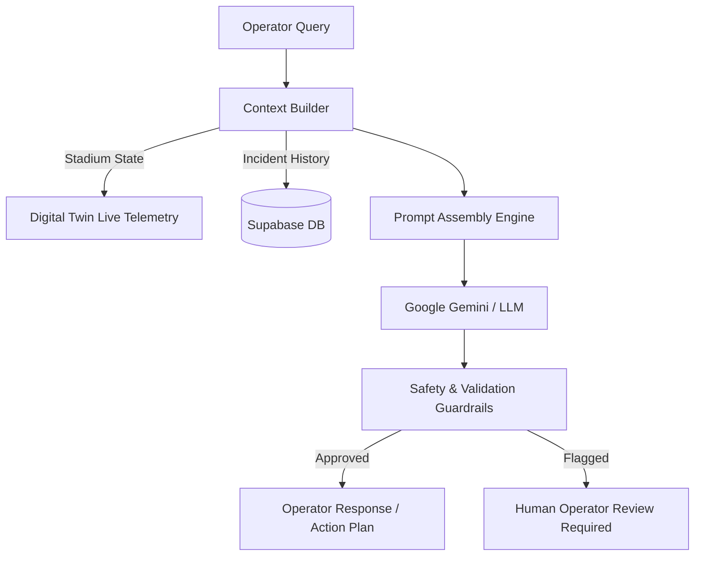

# 🤖 StadiumGenius — AI Workflows & Analytics

> **AI Orchestration:** Google Gemini / LLM Integration  
> **Analytics Engine:** Real-Time Crowd Density Prediction & Anomaly Detection

---

## 1. AI Assistant & LLM Pipeline

The AI Operations Assistant processes natural language prompts from stadium operators and provides real-time situational analysis and automated incident recommendations.

---

## 2. Real-Time Crowd Analytics

- **Density Heatmapping:** Computes zone occupancy percentages dynamically from optical/LiDAR feeds.
- **Queue Wait Time Estimation:** Predicts wait times at stadium gates and concession stands using Poisson flow modeling.
- **Automated Anomaly Alerts:** Triggers alerts when density threshold exceeds 85% capacity in key corridors.
