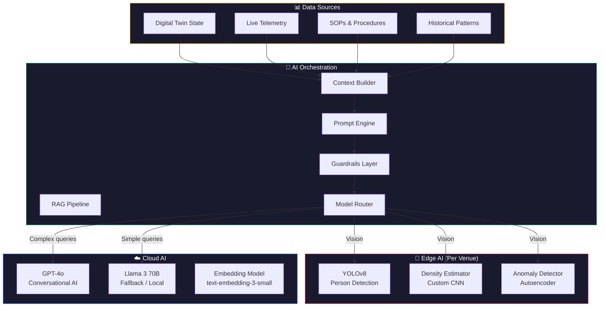
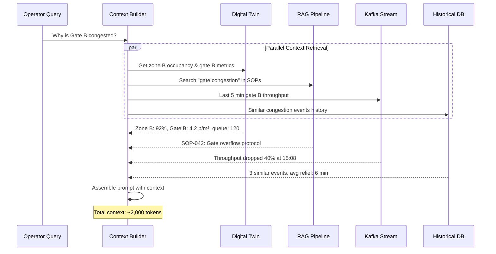
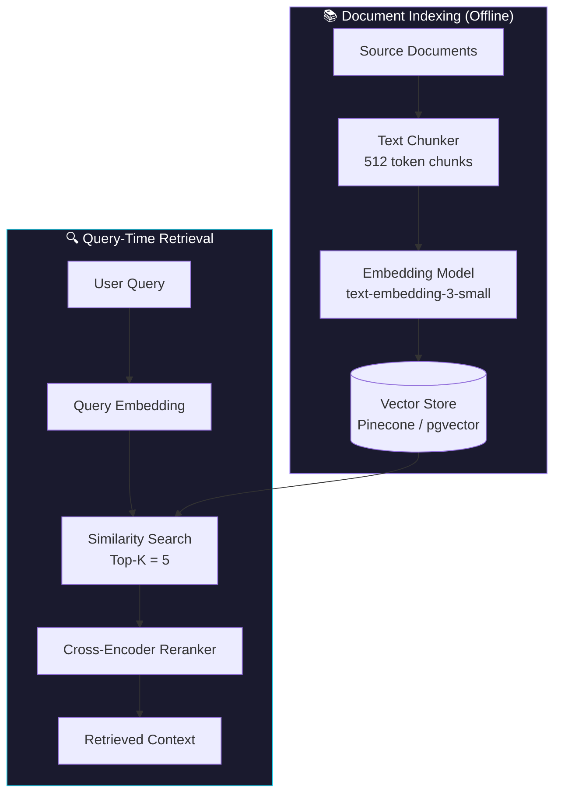
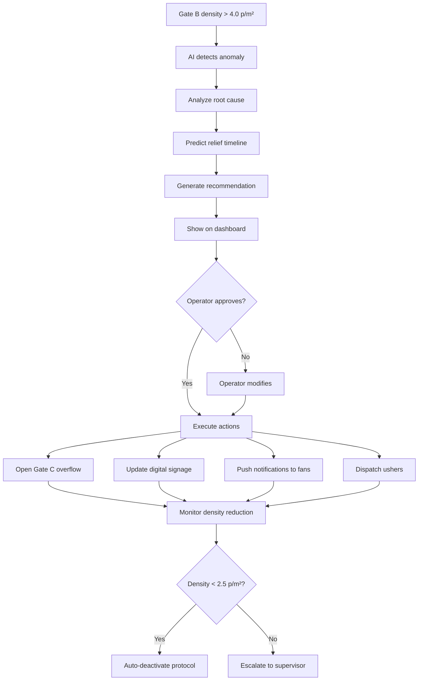
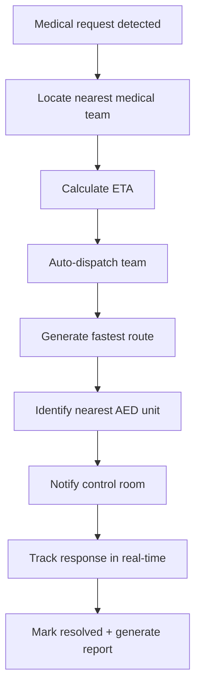
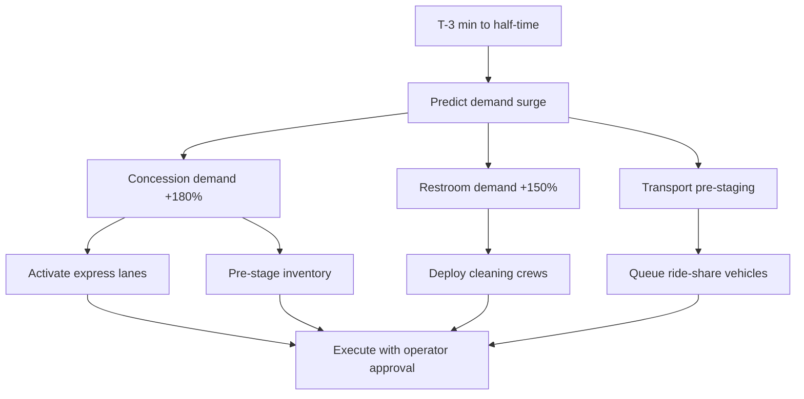
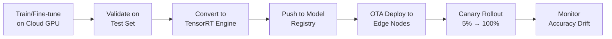

# 🤖 StadiumGenius — AI Workflows & LLM Architecture

> [!IMPORTANT]
> **MVP vs. Target AI Workflows Note:**
> This document describes the **Target Hybrid Cloud/Edge LLM Architecture** (incorporating OpenAI GPT-4o, edge Llama-3 running on Jetson clusters, pgvector RAG, and edge YOLOv8 person detection).
> The current working code in this repository uses a **local keyword-matching response builder** within `server/routes/ai.js`. Integration of the **live Google Gemini 2.0 Flash API** is planned as a future work item.
> For details on the actual implemented codebase, database schema, and files, please refer to the root [README.md](file:///c:/Users/ABHI%20SHARMA/OneDrive/Desktop/projects/Smart-Stadiums-Tournament/README.md) and [docs/SYSTEM_GUIDE.md](file:///c:/Users/ABHI%20SHARMA/OneDrive/Desktop/projects/Smart-Stadiums-Tournament/docs/SYSTEM_GUIDE.md).

> **Version:** 1.0.0 · **Last Updated:** July 2026  
> **Models:** GPT-4o / Llama 3 / YOLOv8 (Target Design) \| Gemini 2.0 (Planned Upgrade) \| Keyword Matches (Actual MVP)


---

## 1. AI Architecture Overview

StadiumGenius uses a **hybrid AI architecture** combining cloud-hosted LLMs for conversational intelligence with edge-deployed vision models for real-time safety inference.



---

## 2. LLM Prompt Architecture

### 2.1 System Prompt Template

```markdown
You are **StadiumGenius AI**, an intelligent operations assistant for FIFA World 
Cup 2026 venues. You are connected to the real-time digital twin of {venue_name}.

## Your Capabilities
- Analyze live crowd density, gate throughput, and zone occupancy
- Generate incident reports with root cause analysis
- Recommend crowd rerouting and resource reallocation
- Provide fan wayfinding with real-time corridor density
- Predict concession demand and staffing needs
- Generate standard operating procedures

## Your Constraints
- NEVER make safety decisions autonomously; always recommend, never execute
- ALWAYS cite data sources (sensors, models, historical) for claims
- NEVER share personally identifiable information (PII)
- Maintain confidence scores for all predictions
- Flag when confidence drops below 85%
- Use structured formats (tables, lists) for operational data

## Current Venue State
{venue_state_json}

## Relevant SOPs
{rag_context}

## Conversation History
{chat_history}
```

### 2.2 Prompt Template Library

| Template | Purpose | Example Trigger |
|----------|---------|----------------|
| **Crowd Analysis** | Zone congestion assessment | "What's the crowd status at Gate B?" |
| **Incident Report** | Structured incident documentation | "Generate incident report for INC-0852" |
| **Fan Wayfinding** | Optimal route calculation | "Best route from Gate D to Section 108" |
| **Demand Prediction** | Concession/transport forecasting | "Predict half-time concession surge" |
| **Evacuation Plan** | Emergency route assessment | "Recommend evacuation for north stands" |
| **Resource Dispatch** | Staff reallocation recommendations | "Suggest usher redeployment for Zone B" |
| **SOP Generation** | Standard procedure creation | "Create procedure for gate overflow" |

### 2.3 Context Building Pipeline



---

## 3. RAG (Retrieval-Augmented Generation) Architecture



### 3.1 RAG Document Sources

| Source | Documents | Update Frequency |
|--------|-----------|-----------------|
| **SOPs** | 150+ standard operating procedures | Weekly |
| **Venue Manuals** | Building layout, capacity charts | Monthly |
| **FIFA Regulations** | Safety standards, crowd limits | Per tournament |
| **Incident History** | Past incident reports & resolutions | After each match |
| **Staff Protocols** | Security, medical, maintenance procedures | Weekly |
| **Equipment Docs** | Sensor specs, camera locations, network topology | Monthly |

### 3.2 Retrieval Configuration

| Parameter | Value | Rationale |
|-----------|-------|-----------|
| Chunk size | 512 tokens | Balance between context and precision |
| Chunk overlap | 64 tokens | Maintain context across boundaries |
| Top-K retrieval | 5 | Enough context without noise |
| Similarity threshold | 0.75 | Filter low-relevance results |
| Reranker | Cross-encoder | Improve retrieval precision |
| Max context tokens | 4,096 | Stay within LLM context budget |

---

## 4. Guardrails & Safety Layer

```mermaid
graph LR
    subgraph Input_Guard["🛡️ Input Guardrails"]
        PII_IN[PII Detection<br/>& Redaction]
        INJECT[Prompt Injection<br/>Detection]
        TOPIC[Topic Boundary<br/>Enforcement]
    end

    subgraph Output_Guard["🛡️ Output Guardrails"]
        PII_OUT[PII Filter]
        FACT[Factual Grounding<br/>Check]
        SAFETY[Safety Assertion<br/>Validator]
        CONF[Confidence<br/>Threshold]
    end

    subgraph HITL["👤 Human-in-the-Loop"]
        REVIEW[Operator Review<br/>for Actions]
        APPROVE[Approval Required<br/>for Execution]
        AUDIT[Audit Trail<br/>Logging]
    end

    Input_Guard --> LLM_G[LLM Inference]
    LLM_G --> Output_Guard
    Output_Guard --> HITL
```



### 4.1 Guardrail Rules

| Rule | Type | Action |
|------|------|--------|
| **PII Detection** | Input & Output | Redact names, ticket IDs, biometric data |
| **Prompt Injection** | Input | Block and log attempt |
| **Safety Critical** | Output | Flag evacuation/lockdown recommendations for mandatory human approval |
| **Confidence < 85%** | Output | Add disclaimer and flag for review |
| **Hallucination Check** | Output | Cross-reference claims against live twin data |
| **Action Authorization** | Output | All physical actions (gate control, PA, dispatch) require operator approval |
| **Rate Limiting** | Input | Max 10 queries/min per operator session |
| **Audit Logging** | All | Every query, response, and action logged with timestamp |

### 4.2 Safety Checks (Real-Time)

```json
{
  "safety_checks": {
    "human_in_the_loop": true,
    "confidence_threshold": 0.85,
    "pii_filter": "enabled",
    "audit_trail": "active",
    "max_autonomous_actions": 0,
    "escalation_on_uncertainty": true
  }
}
```

---

## 5. AI Decision Workflows

### 5.1 Gate Congestion Response



### 5.2 Medical Emergency Response



### 5.3 Half-Time Demand Prediction



---

## 6. Edge AI Models

### 6.1 Model Inventory

| Model | Task | Framework | Hardware | Latency |
|-------|------|-----------|----------|---------|
| YOLOv8n | Person detection | TensorRT | Jetson Orin | 15ms |
| Custom CNN | Crowd density estimation | TensorRT | Jetson Orin | 25ms |
| Autoencoder | Anomaly detection | PyTorch | Jetson Orin | 30ms |
| CLIP | Object classification | TensorRT | Jetson Orin | 45ms |

### 6.2 Model Update Pipeline



---

## 7. AI Evaluation Metrics

| Metric | Target | Current | Method |
|--------|--------|---------|--------|
| Crowd density accuracy | > 90% | 94.2% | Ground truth comparison |
| Recommendation relevance | > 85% | 91% | Operator feedback |
| Response latency (LLM) | < 3s | 1.42s avg | End-to-end timing |
| Hallucination rate | < 2% | 1.3% | Factual grounding checks |
| PII leak rate | 0% | 0% | Automated filter testing |
| Edge inference latency | < 200ms | 142ms avg | Model profiling |
| Anomaly detection recall | > 95% | 93% | Labeled security footage |

---

*Next: [Database Schema →](database-schema.md) · [MVP Roadmap →](mvp-roadmap.md) · [Architecture →](architecture.md)*
