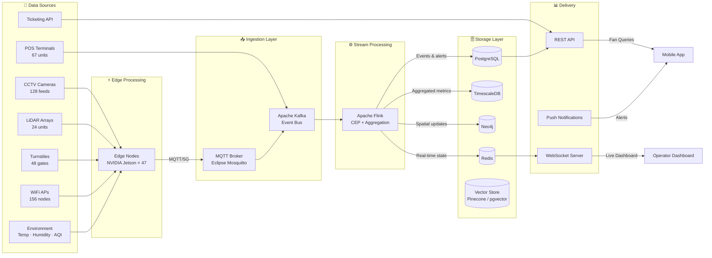
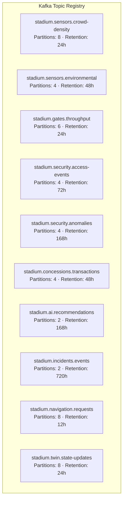
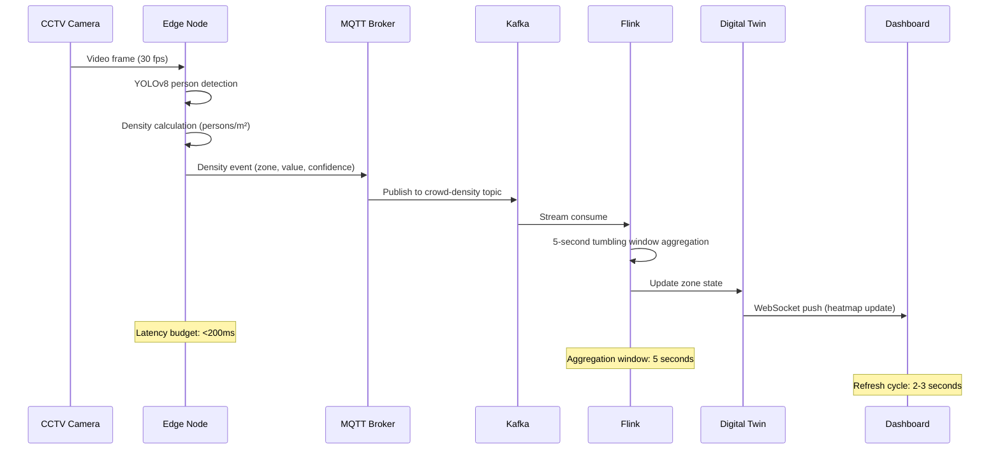
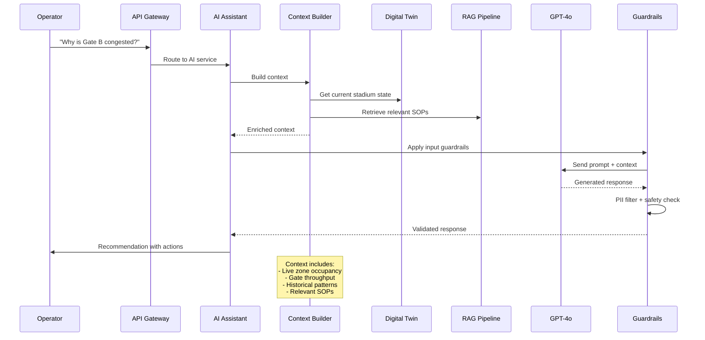
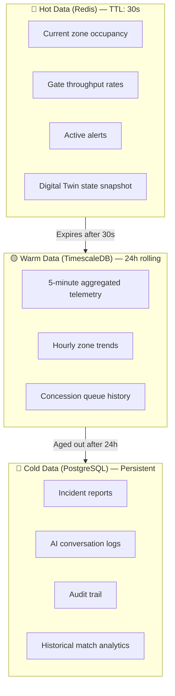

# 📡 StadiumGenius — Data Flow Architecture

> [!IMPORTANT]
> **MVP vs. Target Data Flow Note:**
> This document describes the **Target Real-Time Stream Ingestion and Event Processing Architecture** (telemetry ingestion from 400+ IoT sensors, Kafka brokers, Flink stream analysis, and database writes).
> The current working code in this repository simulates streaming data through **Server-Sent Events (SSE)**.
> For details on the actual implemented codebase, database schema, and files, please refer to the root [README.md](file:///c:/Users/ABHI%20SHARMA/OneDrive/Desktop/projects/Smart-Stadiums-Tournament/README.md) and [docs/SYSTEM_GUIDE.md](file:///c:/Users/ABHI%20SHARMA/OneDrive/Desktop/projects/Smart-Stadiums-Tournament/docs/SYSTEM_GUIDE.md).

> **Version:** 1.0.0 · **Last Updated:** July 2026  
> **Scope:** Target Stream Pipelines (Kafka/Flink) \| Actual MVP Pipeline (Server-Sent Events)


---

## 1. Overview

StadiumGenius processes data through a **five-stage pipeline**: Ingestion → Streaming → Processing → Storage → Delivery. Each stage is designed for real-time throughput at stadium scale (50,000+ events/second during peak operations).

---

## 2. End-to-End Data Flow



---

## 3. Kafka Topic Architecture

StadiumGenius uses **domain-partitioned Kafka topics** to organize event streams:



| Topic | Producer | Consumer(s) | Throughput |
|-------|----------|-------------|-----------|
| `stadium.sensors.crowd-density` | Edge Nodes | Crowd Analytics, Digital Twin | ~10K events/sec |
| `stadium.sensors.environmental` | IoT Sensors | Digital Twin, Dashboard | ~500 events/sec |
| `stadium.gates.throughput` | Turnstiles | Crowd Analytics, Navigation | ~2K events/sec |
| `stadium.security.access-events` | Access Control | Security Service, Audit | ~1K events/sec |
| `stadium.security.anomalies` | Edge AI, CCTV | Incident Manager, Dashboard | ~100 events/sec |
| `stadium.concessions.transactions` | POS Systems | Concession Service | ~500 events/sec |
| `stadium.ai.recommendations` | AI Assistant | Operator Dashboard | ~10 events/sec |
| `stadium.incidents.events` | Incident Manager | All Services | ~5 events/sec |
| `stadium.navigation.requests` | Fan App | Navigation Service | ~5K events/sec |
| `stadium.twin.state-updates` | Digital Twin | Dashboard, AI Assistant | ~1K events/sec |

---

## 4. Telemetry Processing Pipeline

### 4.1 Crowd Density Flow



### 4.2 AI Recommendation Flow



### 4.3 Incident Lifecycle

```mermaid
stateDiagram-v2
    [*] --> Detected: AI/Sensor triggers
    Detected --> Triaged: Auto-priority classification
    Triaged --> Assigned: Dispatch team
    Assigned --> Responding: Team en route
    Responding --> Active: On scene
    Active --> Resolved: Incident contained
    Active --> Escalated: Requires backup
    Escalated --> Responding: Additional resources
    Resolved --> Closed: Report generated
    Closed --> [*]

    note right of Detected: Avg detection: <5s
    note right of Responding: Avg response: 15-47s
    note right of Resolved: AI auto-generates report
```

---

## 5. Data Transformation Stages

| Stage | Input | Transformation | Output | Latency |
|-------|-------|---------------|--------|---------|
| **Edge Inference** | Raw video frames | Person detection, density calc | Density events | < 200ms |
| **Stream Aggregation** | Raw sensor events | 5s tumbling windows, outlier filtering | Aggregated metrics | < 5s |
| **State Update** | Aggregated metrics | Merge into spatial graph | Digital Twin state | < 1s |
| **AI Analysis** | Twin state + query | Context building + LLM inference | Recommendations | < 3s |
| **Dashboard Push** | State changes | Format for UI consumption | WebSocket frames | < 500ms |

---

## 6. Data Freshness & Caching Strategy



---

## 7. Real-Time WebSocket Channels

The dashboard receives live updates via multiplexed WebSocket channels:

| Channel | Payload | Update Frequency |
|---------|---------|-----------------|
| `ws://stadium/twin/heatmap` | Crowd density grid (12×16) | Every 3s |
| `ws://stadium/twin/zones` | Zone occupancy array | Every 5s |
| `ws://stadium/gates/status` | Gate throughput + queue | Every 5s |
| `ws://stadium/alerts/live` | New alert notifications | On event |
| `ws://stadium/kpis/live` | KPI metrics snapshot | Every 5s |
| `ws://stadium/security/access` | Access log entries | On event |
| `ws://stadium/ai/responses` | AI assistant responses | On event |

---

## 8. Data Volume Estimates (Per Match Day)

| Data Type | Volume | Storage |
|-----------|--------|---------|
| CCTV frames processed | ~55M frames | Edge only (not stored) |
| LiDAR point clouds | ~2.6M scans | Edge only |
| Kafka events | ~180M events | TimescaleDB (24h) |
| Crowd density readings | ~4.3M | TimescaleDB |
| Gate throughput events | ~720K | TimescaleDB |
| Concession transactions | ~45K | PostgreSQL |
| AI conversations | ~500 sessions | PostgreSQL |
| Incident records | ~20-60 | PostgreSQL |
| Access control logs | ~165K | PostgreSQL (72h) |

---

*Next: [API Reference →](api.md) · [AI Workflows →](ai-workflows.md) · [Database Schema →](database-schema.md)*
