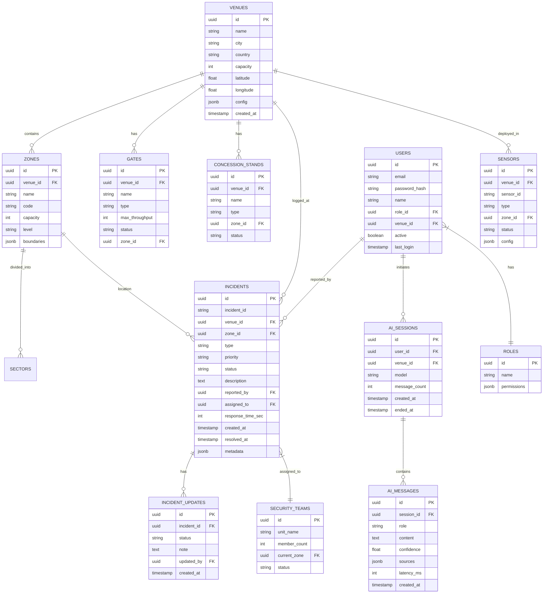
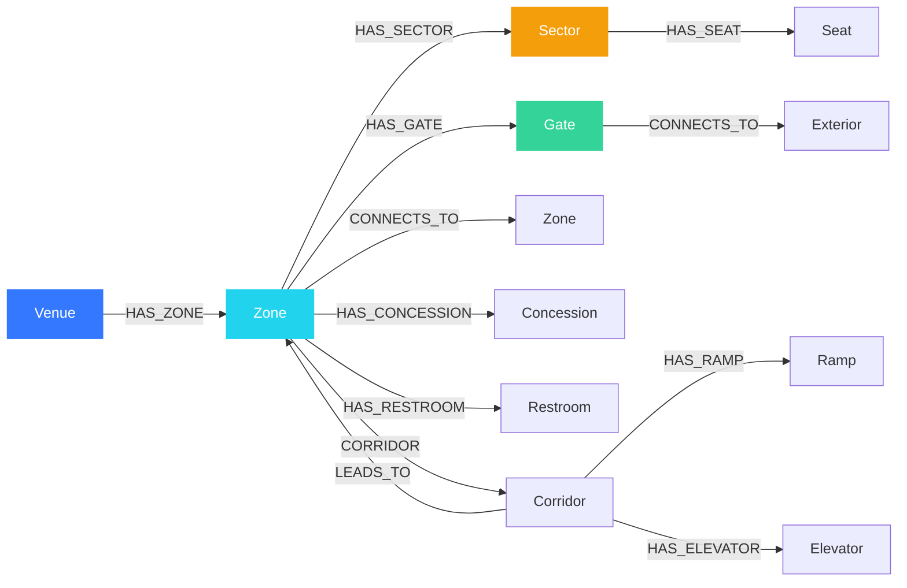

# 🗄️ StadiumGenius — Database Schema

> [!IMPORTANT]
> **MVP vs. Target Database Note:**
> This document describes the **Target Polyglot Persistence Database Design** (PostgreSQL 16, TimescaleDB, Neo4j 5, Redis 7).
> The current working code in this repository uses a **single local SQLite database (`node:sqlite`)** storing all operational records, user profiles, logs, and chats.
> For details on the actual implemented codebase, database schema, and files, please refer to the root [README.md](file:///c:/Users/ABHI%20SHARMA/OneDrive/Desktop/projects/Smart-Stadiums-Tournament/README.md) and [docs/SYSTEM_GUIDE.md](file:///c:/Users/ABHI%20SHARMA/OneDrive/Desktop/projects/Smart-Stadiums-Tournament/docs/SYSTEM_GUIDE.md).

> **Version:** 1.0.0 · **Last Updated:** July 2026  
> **Databases:** PostgreSQL 16 · TimescaleDB · Neo4j 5 (Target Design) \| SQLite (Actual MVP)


---

## 1. Database Architecture

StadiumGenius uses a **polyglot persistence** strategy — each database is chosen for its specific strengths:

```mermaid
graph TB
    subgraph PG["🐘 PostgreSQL 16"]
        direction TB
        PG1[Operational Data<br/>Users · Incidents · Config]
        PG2[AI Conversation Logs]
        PG3[Audit Trail]
    end

    subgraph TS["⏱️ TimescaleDB"]
        direction TB
        TS1[Crowd Density Metrics]
        TS2[Gate Throughput]
        TS3[Environmental Readings]
        TS4[Concession Analytics]
    end

    subgraph NEO["🔗 Neo4j 5"]
        direction TB
        NEO1[Stadium Spatial Graph]
        NEO2[Zone Connectivity]
        NEO3[Navigation Paths]
    end

    subgraph REDIS["⚡ Redis 7"]
        direction TB
        RED1[Live Twin State Cache]
        RED2[Session Store]
        RED3[Rate Limiting]
    end

    APP[Backend Services] --> PG & TS & NEO & REDIS

    style PG fill:#1a1a2e,stroke:#3378ff,color:#fff
    style TS fill:#1a1a2e,stroke:#22d3ee,color:#fff
    style NEO fill:#1a1a2e,stroke:#34d399,color:#fff
    style REDIS fill:#1a1a2e,stroke:#f43f5e,color:#fff
```



---

## 2. PostgreSQL Schema

### 2.1 Entity Relationship Diagram



### 2.2 Core Tables DDL

```sql
-- ══════════════════════════════════════════
-- PostgreSQL Schema — StadiumGenius
-- ══════════════════════════════════════════

-- Enable UUID generation
CREATE EXTENSION IF NOT EXISTS "uuid-ossp";

-- ── Venues ──
CREATE TABLE venues (
    id          UUID PRIMARY KEY DEFAULT uuid_generate_v4(),
    name        VARCHAR(255) NOT NULL,
    city        VARCHAR(100) NOT NULL,
    country     VARCHAR(100) NOT NULL,
    capacity    INTEGER NOT NULL,
    latitude    DOUBLE PRECISION,
    longitude   DOUBLE PRECISION,
    config      JSONB DEFAULT '{}',
    created_at  TIMESTAMPTZ DEFAULT NOW(),
    updated_at  TIMESTAMPTZ DEFAULT NOW()
);

-- ── Zones ──
CREATE TABLE zones (
    id          UUID PRIMARY KEY DEFAULT uuid_generate_v4(),
    venue_id    UUID NOT NULL REFERENCES venues(id) ON DELETE CASCADE,
    name        VARCHAR(100) NOT NULL,
    code        VARCHAR(10) NOT NULL,
    capacity    INTEGER NOT NULL,
    level       VARCHAR(50) DEFAULT 'ground',
    boundaries  JSONB DEFAULT '{}',
    UNIQUE(venue_id, code)
);

CREATE INDEX idx_zones_venue ON zones(venue_id);

-- ── Gates ──
CREATE TABLE gates (
    id              UUID PRIMARY KEY DEFAULT uuid_generate_v4(),
    venue_id        UUID NOT NULL REFERENCES venues(id) ON DELETE CASCADE,
    zone_id         UUID REFERENCES zones(id),
    name            VARCHAR(100) NOT NULL,
    gate_type       VARCHAR(50) DEFAULT 'standard',
    max_throughput  INTEGER DEFAULT 500,
    status          VARCHAR(20) DEFAULT 'open',
    UNIQUE(venue_id, name)
);

-- ── Roles & Users ──
CREATE TABLE roles (
    id          UUID PRIMARY KEY DEFAULT uuid_generate_v4(),
    name        VARCHAR(50) UNIQUE NOT NULL,
    permissions JSONB DEFAULT '[]'
);

INSERT INTO roles (name, permissions) VALUES
    ('admin', '["*"]'),
    ('operator', '["dashboard:read","alerts:read","ai:query","incidents:write"]'),
    ('security', '["security:*","incidents:*","cctv:read"]'),
    ('viewer', '["dashboard:read"]');

CREATE TABLE users (
    id            UUID PRIMARY KEY DEFAULT uuid_generate_v4(),
    email         VARCHAR(255) UNIQUE NOT NULL,
    password_hash VARCHAR(255) NOT NULL,
    name          VARCHAR(255) NOT NULL,
    role_id       UUID NOT NULL REFERENCES roles(id),
    venue_id      UUID REFERENCES venues(id),
    active        BOOLEAN DEFAULT TRUE,
    last_login    TIMESTAMPTZ,
    created_at    TIMESTAMPTZ DEFAULT NOW()
);

-- ── Incidents ──
CREATE TABLE incidents (
    id                UUID PRIMARY KEY DEFAULT uuid_generate_v4(),
    incident_id       VARCHAR(20) UNIQUE NOT NULL,
    venue_id          UUID NOT NULL REFERENCES venues(id),
    zone_id           UUID REFERENCES zones(id),
    type              VARCHAR(100) NOT NULL,
    priority          VARCHAR(20) NOT NULL CHECK (priority IN ('critical','high','medium','low')),
    status            VARCHAR(30) NOT NULL DEFAULT 'detected',
    description       TEXT,
    reported_by       UUID REFERENCES users(id),
    assigned_to       UUID,
    response_time_sec INTEGER,
    metadata          JSONB DEFAULT '{}',
    created_at        TIMESTAMPTZ DEFAULT NOW(),
    resolved_at       TIMESTAMPTZ
);

CREATE INDEX idx_incidents_venue ON incidents(venue_id);
CREATE INDEX idx_incidents_status ON incidents(status);
CREATE INDEX idx_incidents_priority ON incidents(priority);
CREATE INDEX idx_incidents_created ON incidents(created_at DESC);

CREATE TABLE incident_updates (
    id          UUID PRIMARY KEY DEFAULT uuid_generate_v4(),
    incident_id UUID NOT NULL REFERENCES incidents(id) ON DELETE CASCADE,
    status      VARCHAR(30) NOT NULL,
    note        TEXT,
    updated_by  UUID REFERENCES users(id),
    created_at  TIMESTAMPTZ DEFAULT NOW()
);

-- ── AI Conversations ──
CREATE TABLE ai_sessions (
    id            UUID PRIMARY KEY DEFAULT uuid_generate_v4(),
    user_id       UUID NOT NULL REFERENCES users(id),
    venue_id      UUID NOT NULL REFERENCES venues(id),
    model         VARCHAR(100) DEFAULT 'gpt-4o',
    message_count INTEGER DEFAULT 0,
    created_at    TIMESTAMPTZ DEFAULT NOW(),
    ended_at      TIMESTAMPTZ
);

CREATE TABLE ai_messages (
    id          UUID PRIMARY KEY DEFAULT uuid_generate_v4(),
    session_id  UUID NOT NULL REFERENCES ai_sessions(id) ON DELETE CASCADE,
    role        VARCHAR(20) NOT NULL CHECK (role IN ('system','user','assistant')),
    content     TEXT NOT NULL,
    confidence  REAL,
    sources     JSONB DEFAULT '[]',
    latency_ms  INTEGER,
    created_at  TIMESTAMPTZ DEFAULT NOW()
);

CREATE INDEX idx_ai_messages_session ON ai_messages(session_id);

-- ── Audit Log ──
CREATE TABLE audit_log (
    id          UUID PRIMARY KEY DEFAULT uuid_generate_v4(),
    user_id     UUID REFERENCES users(id),
    action      VARCHAR(100) NOT NULL,
    resource    VARCHAR(100),
    details     JSONB DEFAULT '{}',
    ip_address  INET,
    created_at  TIMESTAMPTZ DEFAULT NOW()
);

CREATE INDEX idx_audit_created ON audit_log(created_at DESC);
```

---

## 3. TimescaleDB Schema (Time-Series)

```sql
-- ══════════════════════════════════════════
-- TimescaleDB Schema — Sensor Telemetry
-- ══════════════════════════════════════════

-- ── Crowd Density ──
CREATE TABLE crowd_density (
    time        TIMESTAMPTZ NOT NULL,
    venue_id    UUID NOT NULL,
    zone_code   VARCHAR(10) NOT NULL,
    density     REAL NOT NULL,          -- persons per m²
    occupancy   REAL NOT NULL,          -- percentage
    current     INTEGER NOT NULL,        -- current count
    capacity    INTEGER NOT NULL,
    source      VARCHAR(50),            -- 'cctv', 'lidar', 'wifi'
    confidence  REAL DEFAULT 0.9
);

SELECT create_hypertable('crowd_density', 'time');

CREATE INDEX idx_crowd_venue_zone ON crowd_density(venue_id, zone_code, time DESC);

-- ── Gate Throughput ──
CREATE TABLE gate_throughput (
    time        TIMESTAMPTZ NOT NULL,
    venue_id    UUID NOT NULL,
    gate_name   VARCHAR(50) NOT NULL,
    throughput  INTEGER NOT NULL,        -- fans per minute
    queue_length INTEGER NOT NULL,
    avg_wait    REAL NOT NULL,           -- minutes
    status      VARCHAR(20) NOT NULL
);

SELECT create_hypertable('gate_throughput', 'time');

-- ── Environmental ──
CREATE TABLE environmental (
    time        TIMESTAMPTZ NOT NULL,
    venue_id    UUID NOT NULL,
    zone_code   VARCHAR(10),
    temperature REAL,                    -- Celsius
    humidity    REAL,                    -- percentage
    wind_speed  REAL,                    -- km/h
    air_quality INTEGER                  -- AQI
);

SELECT create_hypertable('environmental', 'time');

-- ── Concession Metrics ──
CREATE TABLE concession_metrics (
    time           TIMESTAMPTZ NOT NULL,
    venue_id       UUID NOT NULL,
    stand_name     VARCHAR(100) NOT NULL,
    queue_length   INTEGER NOT NULL,
    avg_wait       REAL NOT NULL,
    revenue        DECIMAL(10, 2),
    status         VARCHAR(30)
);

SELECT create_hypertable('concession_metrics', 'time');

-- ── Access Events ──
CREATE TABLE access_events (
    time        TIMESTAMPTZ NOT NULL,
    venue_id    UUID NOT NULL,
    event       TEXT NOT NULL,
    zone        VARCHAR(50) NOT NULL,
    event_type  VARCHAR(20) NOT NULL,    -- 'success', 'denied', 'alert'
    credential  VARCHAR(50)
);

SELECT create_hypertable('access_events', 'time');

-- ═══ Retention Policies ═══
SELECT add_retention_policy('crowd_density',      INTERVAL '7 days');
SELECT add_retention_policy('gate_throughput',     INTERVAL '7 days');
SELECT add_retention_policy('environmental',       INTERVAL '30 days');
SELECT add_retention_policy('concession_metrics',  INTERVAL '30 days');
SELECT add_retention_policy('access_events',       INTERVAL '14 days');

-- ═══ Continuous Aggregates ═══
CREATE MATERIALIZED VIEW crowd_density_5min
WITH (timescaledb.continuous) AS
SELECT
    time_bucket('5 minutes', time) AS bucket,
    venue_id,
    zone_code,
    AVG(density) AS avg_density,
    MAX(density) AS max_density,
    AVG(occupancy) AS avg_occupancy,
    COUNT(*) AS sample_count
FROM crowd_density
GROUP BY bucket, venue_id, zone_code;

SELECT add_continuous_aggregate_policy('crowd_density_5min',
    start_offset    => INTERVAL '1 hour',
    end_offset      => INTERVAL '5 minutes',
    schedule_interval => INTERVAL '5 minutes'
);
```

---

## 4. Neo4j Schema (Spatial Graph)

### 4.1 Graph Data Model



### 4.2 Cypher Schema Definition

```cypher
// ══════════════════════════════════════════
// Neo4j Schema — Stadium Spatial Graph
// ══════════════════════════════════════════

// ── Constraints ──
CREATE CONSTRAINT venue_id IF NOT EXISTS
FOR (v:Venue) REQUIRE v.id IS UNIQUE;

CREATE CONSTRAINT zone_code IF NOT EXISTS
FOR (z:Zone) REQUIRE z.code IS UNIQUE;

CREATE CONSTRAINT gate_name IF NOT EXISTS
FOR (g:Gate) REQUIRE g.name IS UNIQUE;

// ── Venue ──
CREATE (v:Venue {
    id: 'metlife',
    name: 'MetLife Stadium',
    city: 'New York/New Jersey',
    capacity: 82500,
    lat: 40.8135,
    lng: -74.0745
});

// ── Zones ──
UNWIND ['A','B','C','D','E','F','G','H'] AS code
CREATE (z:Zone {
    code: code,
    name: 'Zone ' + code,
    capacity: 9200 + toInteger(rand() * 2000),
    level: 'ground'
});

// ── Gates ──
UNWIND ['Gate A','Gate B','Gate C','Gate D','Gate E','Gate F'] AS name
CREATE (g:Gate {
    name: name,
    type: 'standard',
    max_throughput: 500,
    status: 'open'
});

// ── Zone Connectivity ──
MATCH (a:Zone {code: 'A'}), (b:Zone {code: 'B'})
CREATE (a)-[:CONNECTS_TO {distance: 120, corridor: 'North Concourse'}]->(b);

MATCH (b:Zone {code: 'B'}), (c:Zone {code: 'C'})
CREATE (b)-[:CONNECTS_TO {distance: 95, corridor: 'East Corridor'}]->(c);

// ... additional connections for all zones

// ── Venue → Zone relationships ──
MATCH (v:Venue {id: 'metlife'}), (z:Zone)
CREATE (v)-[:HAS_ZONE]->(z);

// ── Zone → Gate relationships ──
MATCH (z:Zone {code: 'A'}), (g:Gate {name: 'Gate A'})
CREATE (z)-[:HAS_GATE]->(g);

// ── Navigation Query Example ──
// Find shortest path from Gate D to Section 108
MATCH path = shortestPath(
    (start:Gate {name: 'Gate D'})-[:CONNECTS_TO*..10]-(end:Sector {name: 'Section 108'})
)
RETURN path, reduce(d = 0, r IN relationships(path) | d + r.distance) AS total_distance;
```

---

## 5. Redis Key Schema

| Key Pattern | Type | TTL | Description |
|-------------|------|-----|-------------|
| `twin:{venue}:state` | Hash | 30s | Current digital twin state |
| `twin:{venue}:heatmap` | String (JSON) | 5s | Crowd density grid |
| `twin:{venue}:zone:{code}` | Hash | 10s | Zone occupancy snapshot |
| `twin:{venue}:gate:{name}` | Hash | 10s | Gate status |
| `session:{user_id}` | Hash | 1h | User session data |
| `ratelimit:{user_id}` | String (counter) | 1m | API rate limit counter |
| `alerts:{venue}:active` | List | — | Active alert queue |
| `cache:nav:{from}:{to}` | String (JSON) | 5m | Cached navigation routes |

---

## 6. Data Volume Projections

| Table | Rows/Match Day | Growth/Year | Retention |
|-------|---------------|-------------|-----------|
| `crowd_density` | ~4.3M | ~260M | 7 days |
| `gate_throughput` | ~720K | ~43M | 7 days |
| `environmental` | ~86K | ~5.2M | 30 days |
| `concession_metrics` | ~45K | ~2.7M | 30 days |
| `access_events` | ~165K | ~10M | 14 days |
| `incidents` | ~20-60 | ~3.6K | Permanent |
| `ai_messages` | ~2K | ~120K | Permanent |
| `audit_log` | ~50K | ~3M | 90 days |

---

*Next: [MVP Roadmap →](mvp-roadmap.md) · [Architecture →](architecture.md) · [Data Flow →](data-flow.md)*
