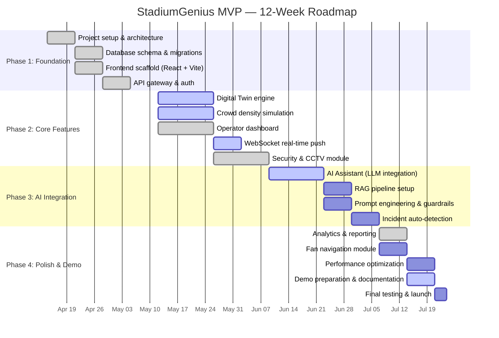

# 📋 StadiumGenius — MVP Roadmap

> **Version:** 1.0.0 · **Last Updated:** July 2026  
> **Timeline:** 12-week MVP · **Team Size:** 4–6 developers  
> **Target:** Hackathon demo / Capstone project / Investor pitch

---

## 1. Vision & Success Criteria

### Project Vision

> Build an **AI-powered smart stadium platform** that demonstrates how Digital Twins, IoT, and Generative AI can transform FIFA World Cup 2026 venue operations — improving fan safety, reducing queue times, and enabling predictive operational intelligence.

### MVP Success Metrics

| KPI | Baseline | Target | Measurement |
|-----|----------|--------|-------------|
| Queue time reduction | 4.8 min | 2.5 min (↓47%) | Simulated telemetry |
| Incident response time | 45 sec | < 15 sec (↓67%) | Dashboard metrics |
| AI recommendation accuracy | — | > 90% | Operator feedback |
| Dashboard refresh latency | — | < 2 sec | WebSocket timing |
| Fan navigation latency | — | < 1 sec | API response time |
| Edge node uptime | — | > 99% | Health monitoring |
| Fan satisfaction score | 4.1 | 4.8 / 5.0 | Simulated NPS |

---

## 2. Roadmap Timeline

---

## 3. Phase Breakdown

### Phase 1: Foundation (Weeks 1–3) ✅ Complete

| Task | Status | Deliverable |
|------|--------|-------------|
| Initialize React + Vite project | ✅ Done | Project scaffold with Tailwind CSS 4 |
| Design system & component library | ✅ Done | Glass cards, stat cards, alert cards |
| Database schema design | ✅ Done | PostgreSQL + TimescaleDB + Neo4j schemas |
| Mock data system | ✅ Done | Simulated telemetry generators |
| Authentication system design | ✅ Done | JWT + RBAC architecture |
| API specification | ✅ Done | REST + WebSocket API docs |

---

### Phase 2: Core Features (Weeks 4–7) 🔄 In Progress

| Task | Status | Deliverable |
|------|--------|-------------|
| **Operator Dashboard** | ✅ Done | KPI cards, charts, alerts, heatmap |
| **Digital Twin page** | ✅ Done | Multi-layer visualization with gate markers |
| **Crowd Management page** | ✅ Done | Density forecast, zone radial chart, predictions |
| **Security & Safety page** | ✅ Done | Zones, CCTV grid, evacuation, patrols, incidents |
| **Concessions page** | ✅ Done | Queue monitoring, revenue tracking |
| **Broadcast page** | ✅ Done | Media operations interface |
| **Settings page** | ✅ Done | System configuration |
| WebSocket live updates | 🔄 Simulated | 5-second polling with mock data |
| Backend API (FastAPI) | 📝 Planned | REST endpoints for all modules |

---

### Phase 3: AI Integration (Weeks 8–10) 🔄 In Progress

| Task | Status | Deliverable |
|------|--------|-------------|
| **AI Assistant UI** | ✅ Done | Chat interface with quick prompts |
| **Simulated AI responses** | ✅ Done | Pre-built response templates |
| LLM API integration (GPT-4o) | 📝 Planned | Real OpenAI API calls |
| RAG pipeline with SOPs | 📝 Planned | Vector store + retrieval |
| Prompt template library | 📝 Planned | 7 specialized prompt templates |
| Guardrails & safety layer | 📝 Planned | PII filter, confidence thresholds |
| AI-powered incident detection | 📝 Planned | Anomaly → alert pipeline |

---

### Phase 4: Polish & Demo (Weeks 11–12) 🔄 Active

| Task | Status | Deliverable |
|------|--------|-------------|
| **Analytics page** | ✅ Done | Match history, radar chart, KPIs |
| Fan navigation API | 📝 Planned | Shortest-path routing |
| Performance profiling | 📝 Planned | Lighthouse audit, bundle optimization |
| **Documentation suite** | 🔄 Active | 7 comprehensive docs |
| Demo video / walkthrough | 📝 Planned | 3-min demo recording |
| README overhaul | 📝 Planned | Professional landing page |

---

## 4. Feature Backlog (Post-MVP)

### Priority: High 🔴

| Feature | Description | Effort |
|---------|-------------|--------|
| Real backend (FastAPI) | Replace mock data with actual API server | 2 weeks |
| Real LLM integration | Connect GPT-4o API for AI Assistant | 1 week |
| WebSocket server | Replace polling with live push | 1 week |
| User authentication | Login flow, session management | 1 week |
| Docker Compose setup | Full local dev environment | 3 days |

### Priority: Medium 🟡

| Feature | Description | Effort |
|---------|-------------|--------|
| Kafka streaming | Real event pipeline | 2 weeks |
| Edge node simulator | Simulated NVIDIA Jetson telemetry | 1 week |
| Neo4j spatial graph | Real navigation graph queries | 1 week |
| RAG with real SOPs | Document indexing + retrieval | 1 week |
| Mobile app (React Native) | Fan-facing mobile experience | 3 weeks |

### Priority: Low 🟢 (Future Phases)

| Feature | Description | Effort |
|---------|-------------|--------|
| CCTV vision AI (YOLOv8) | Real camera feed analysis | 3 weeks |
| LiDAR integration | 3D point cloud processing | 2 weeks |
| Predictive staffing | ML model for staff allocation | 2 weeks |
| Multi-venue dashboard | Cross-stadium command center | 3 weeks |
| AR glass navigation | Augmented reality wayfinding | 4 weeks |
| 3D Digital Twin (Three.js) | WebGL stadium model | 4 weeks |

---

## 5. Sprint Plan (Current Phase)

### Sprint 12 — Documentation & Polish (July 7–14, 2026)

| # | Task | Assignee | Story Points | Status |
|---|------|----------|-------------|--------|
| 1 | Architecture documentation | Dev 1 | 5 | ✅ Done |
| 2 | Data flow documentation | Dev 1 | 3 | ✅ Done |
| 3 | API reference documentation | Dev 1 | 5 | ✅ Done |
| 4 | Deployment guide | Dev 1 | 5 | ✅ Done |
| 5 | AI workflows documentation | Dev 1 | 5 | ✅ Done |
| 6 | Database schema documentation | Dev 1 | 5 | ✅ Done |
| 7 | MVP roadmap documentation | Dev 1 | 3 | ✅ Done |
| 8 | Fix existing doc errors | Dev 1 | 2 | ✅ Done |
| 9 | README overhaul | Dev 2 | 3 | 📝 Planned |
| 10 | Performance audit | Dev 2 | 3 | 📝 Planned |

**Sprint velocity:** 39 story points

---

## 6. Technical Debt Tracker

| Item | Impact | Priority | Effort |
|------|--------|----------|--------|
| Mock data → real API | High | P0 | 2 weeks |
| Simulated AI → real LLM | High | P0 | 1 week |
| Polling → WebSocket | Medium | P1 | 1 week |
| No error boundaries | Medium | P1 | 2 days |
| No loading states | Low | P2 | 1 day |
| No unit tests | Medium | P1 | 1 week |
| No E2E tests | Low | P2 | 1 week |
| Bundle size optimization | Low | P2 | 2 days |
| Accessibility (a11y) audit | Medium | P1 | 3 days |
| Mobile responsive polish | Low | P2 | 2 days |

---

## 7. Risk Register

| Risk | Probability | Impact | Mitigation |
|------|------------|--------|------------|
| LLM API costs exceed budget | Medium | High | Use Llama 3 as fallback; cache frequent queries |
| Edge hardware not available | Low | Medium | Simulate edge nodes in Docker |
| Kafka complexity for hackathon | Medium | Medium | Use Redis Pub/Sub as lightweight alternative |
| Real-time performance issues | Medium | High | Pre-aggregate data; use CDN for static assets |
| AI hallucination in safety context | Low | Critical | Mandatory human-in-the-loop for all actions |
| Data privacy compliance | Medium | High | PII anonymization; no real fan data in MVP |

---

## 8. Demo Scenario Script

### 3-Minute Investor Demo Flow

| Time | Scene | Talking Point |
|------|-------|---------------|
| 0:00 | Dashboard overview | "StadiumGenius monitors 82,500 fans in real-time" |
| 0:30 | Digital Twin heatmap | "Our Digital Twin shows live crowd density across every zone" |
| 1:00 | Gate congestion alert | "AI detects Gate B congestion — recommends overflow routing" |
| 1:30 | AI Assistant chat | "Operator asks AI: 'Why is Gate B congested?'" |
| 2:00 | AI recommendation | "AI generates actionable recommendation with 94% confidence" |
| 2:15 | Security dashboard | "128 CCTV feeds with AI anomaly detection" |
| 2:30 | Analytics page | "AI improves performance match-over-match — 47% queue reduction" |
| 2:50 | Architecture diagram | "Edge + Cloud hybrid — sub-second latency for safety" |
| 3:00 | Closing | "Ready for FIFA World Cup 2026 — 48 matches, 16 venues" |

---

## 9. Team Structure

| Role | Responsibility | Count |
|------|---------------|-------|
| **Full-Stack Lead** | Architecture, backend, DevOps | 1 |
| **Frontend Developer** | React dashboard, UI/UX | 1–2 |
| **AI/ML Engineer** | LLM integration, RAG, edge models | 1 |
| **Data Engineer** | Kafka, databases, telemetry pipeline | 1 |
| **Product / Demo Lead** | Requirements, demo prep, documentation | 1 |

---

*Next: [Architecture →](architecture.md) · [Data Flow →](data-flow.md) · [API Reference →](api.md)*
