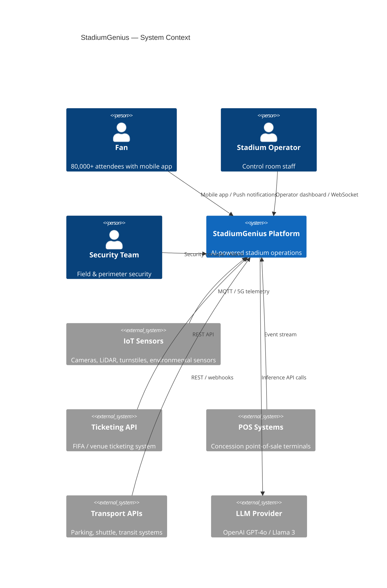
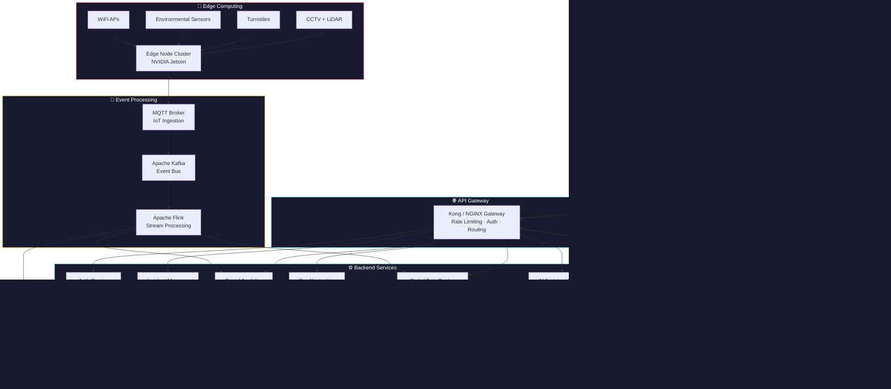
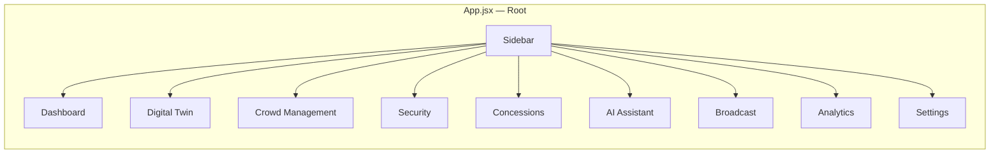
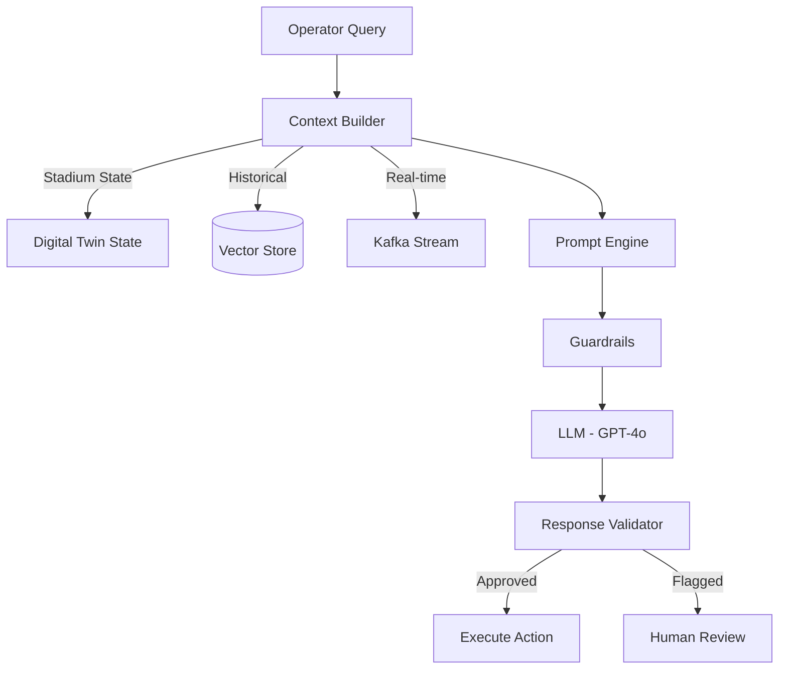
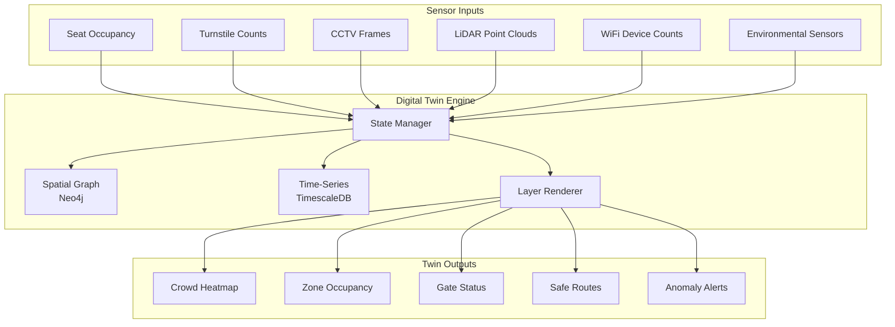
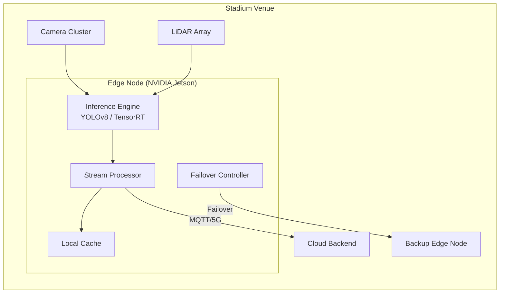
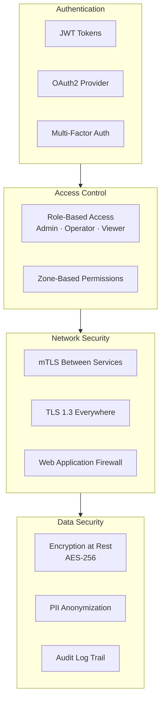

# 🏟️ StadiumGenius — System Architecture

> **Version:** 1.0.0 · **Last Updated:** July 2026  
> **Status:** MVP — FIFA World Cup 2026  
> **Classification:** Technical Architecture Document

---

## 1. Executive Summary

StadiumGenius is an **AI-powered smart stadium operations platform** designed for FIFA World Cup 2026 venues. It combines Digital Twins, IoT telemetry, 5G edge computing, and Generative AI (LLM) to deliver real-time crowd management, security orchestration, fan navigation, and operational intelligence.

The architecture follows a **layered, event-driven microservices** model with edge-cloud hybrid processing to meet the sub-second latency requirements of live stadium operations.

---

## 2. Architecture Principles

| Principle | Description |
|-----------|-------------|
| **Event-Driven** | All telemetry flows through Apache Kafka; components react to events, not polling |
| **Edge-First** | Safety-critical inference (crowd density, anomaly detection) runs on NVIDIA Jetson edge nodes |
| **Human-in-the-Loop** | AI recommendations require operator approval before execution |
| **Separation of Concerns** | Frontend, backend, AI, streaming, and data layers are independently deployable |
| **Fail-Safe Defaults** | System degrades gracefully; edge nodes fail over automatically |
| **Zero Trust Security** | mTLS between services, JWT auth for users, RBAC for operators |

---

## 3. System Context Diagram



---

## 4. High-Level Architecture



---

## 5. Component Architecture

### 5.1 Frontend (React + Vite)

The MVP dashboard is a single-page application built with:

| Technology | Purpose |
|-----------|---------|
| **React 19** | Component framework |
| **Vite 8** | Build tool with HMR |
| **React Router v7** | Client-side routing |
| **Tailwind CSS v4** | Utility-first styling |
| **Framer Motion** | Animations & transitions |
| **Recharts** | Data visualization (charts, heatmaps) |
| **Lucide React** | Icon system |

**Page Architecture:**



### 5.2 Backend (FastAPI — Planned)

```
backend/
├── app/
│   ├── api/           # REST endpoints
│   ├── ai/            # LLM orchestration
│   ├── analytics/     # Crowd prediction models
│   ├── auth/          # JWT + OAuth2
│   ├── digital_twin/  # Twin state engine
│   ├── ingestion/     # Kafka consumers
│   ├── models/        # SQLAlchemy / Pydantic
│   ├── services/      # Business logic
│   ├── websocket/     # Real-time push
│   └── main.py        # FastAPI entry point
```

### 5.3 AI / LLM Layer



---

## 6. Digital Twin Architecture

The Digital Twin maintains a **live virtual model** of the stadium, updated every 2–5 seconds.



**Twin Layers:**

| Layer | Data Source | Update Interval |
|-------|-----------|----------------|
| Crowd Density | CCTV + LiDAR + WiFi | 2s |
| Security Zones | Access control + patrols | 1s |
| Environmental | Temp, humidity, wind, AQI | 10s |
| Infrastructure | Power, network, POS status | 30s |

---

## 7. Edge Computing Architecture



**Edge Specifications:**

| Metric | Target |
|--------|--------|
| Inference latency | < 200ms |
| Edge nodes per venue | 47 |
| Camera feeds per node | 4–8 |
| Failover time | < 500ms |
| Local buffer | 30 min offline operation |

---

## 8. Security Architecture



**Operator Roles:**

| Role | Permissions |
|------|------------|
| **Admin** | Full system access, configuration, user management |
| **Operator** | Dashboard, alerts, approve AI recommendations |
| **Security** | Security zones, CCTV, incident management |
| **Viewer** | Read-only dashboard access |

---

## 9. Technology Stack Summary

| Layer | Technology | Purpose |
|-------|-----------|---------|
| **Frontend** | React 19, Vite 8, Tailwind CSS 4 | Operator dashboard & fan app |
| **Mobile** | React Native | Fan mobile experience |
| **Backend** | FastAPI (Python) | REST/WebSocket API server |
| **AI/LLM** | OpenAI GPT-4o, Llama 3 | Operational intelligence |
| **Streaming** | Apache Kafka, Flink | Event processing pipeline |
| **IoT** | MQTT, 5G | Sensor data ingestion |
| **Cache** | Redis | Real-time state cache |
| **Database** | PostgreSQL | Operational data |
| **Time-Series** | TimescaleDB | Sensor telemetry history |
| **Graph** | Neo4j | Spatial relationships & navigation |
| **Edge** | NVIDIA Jetson, TensorRT | On-premise ML inference |
| **Containers** | Docker, Kubernetes | Deployment orchestration |
| **Cloud** | Azure / AWS | Cloud infrastructure |
| **Monitoring** | Prometheus, Grafana | Observability |
| **CI/CD** | GitHub Actions | Build & deploy pipeline |

---

## 10. Architecture Decision Records (ADRs)

### ADR-001: Event-Driven over Request-Response

**Decision:** Use Apache Kafka as the central event bus rather than synchronous REST calls between services.  
**Rationale:** Stadium telemetry generates 50,000+ events/second during peak; synchronous calls would create cascading failures.  
**Consequences:** Added complexity in event ordering; requires idempotent consumers.

### ADR-002: Edge-First Inference

**Decision:** Run safety-critical ML models (crowd density, anomaly detection) on NVIDIA Jetson edge nodes.  
**Rationale:** Cloud round-trip latency (100–300ms) is unacceptable for real-time crowd safety; edge inference achieves < 200ms.  
**Consequences:** Increased hardware costs; requires OTA model update pipeline.

### ADR-003: Neo4j for Spatial Graph

**Decision:** Use Neo4j (graph database) for stadium spatial modeling instead of PostGIS.  
**Rationale:** Stadium navigation requires traversal of complex spatial relationships (zones → corridors → gates → exits) that map naturally to graph queries.  
**Consequences:** Additional database to manage; team needs Cypher expertise.

---

## 11. Scalability & Performance

| Metric | Target | Architecture Strategy |
|--------|--------|----------------------|
| Concurrent fans | 82,500 | Horizontal pod scaling, CDN for static assets |
| Telemetry ingestion | 50K events/sec | Kafka partitioning, edge pre-processing |
| Dashboard refresh | < 2 sec | WebSocket push, Redis cache |
| AI response time | < 3 sec | Edge inference + cloud LLM hybrid |
| Fan navigation | < 1 sec | Precomputed graph routes, local cache |
| System uptime | 99.95% | Multi-AZ deployment, edge failover |

---

## 12. Disaster Recovery

| Scenario | Recovery Strategy | RTO |
|----------|------------------|-----|
| Cloud region outage | Failover to secondary region | < 5 min |
| Edge node failure | Automatic failover to nearest healthy node | < 500ms |
| Kafka broker failure | Multi-broker cluster, replication factor 3 | < 30s |
| Database failure | Standby replica promotion | < 60s |
| Network partition | Edge nodes operate autonomously with 30-min local buffer | 0s (degraded) |

---

*Next: [Data Flow →](data-flow.md) · [API Reference →](api.md) · [Deployment →](deployment.md)*
