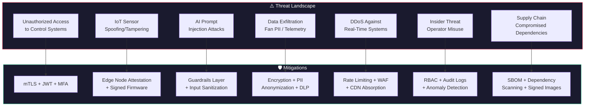
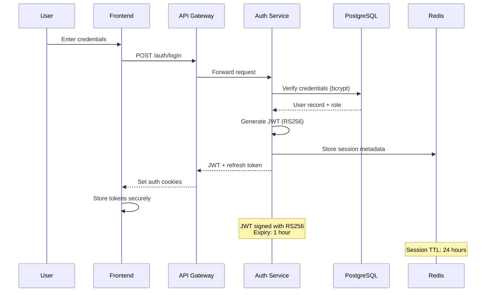
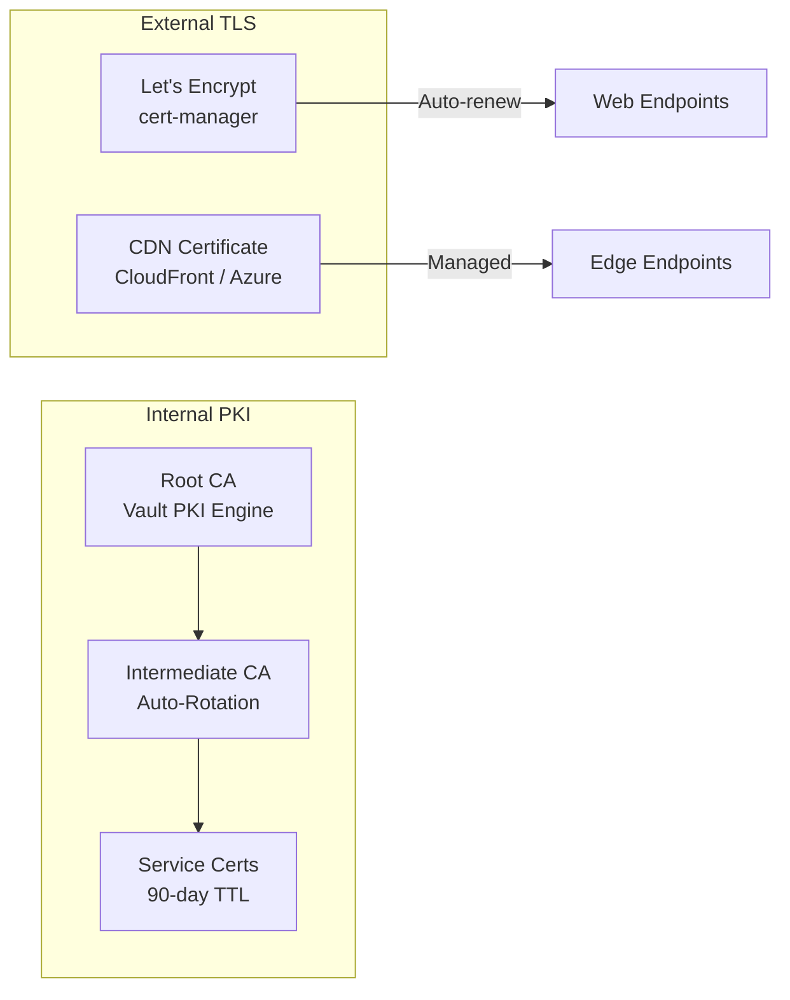
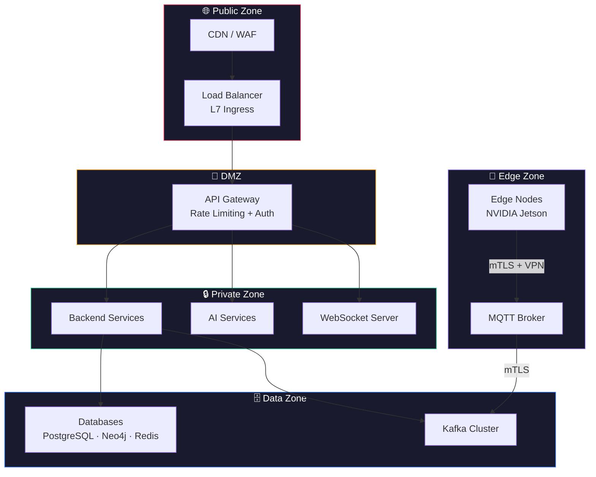
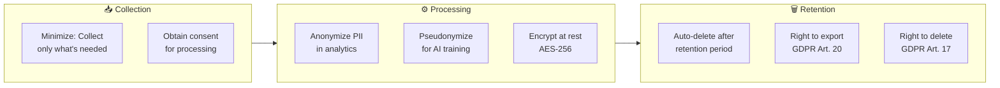
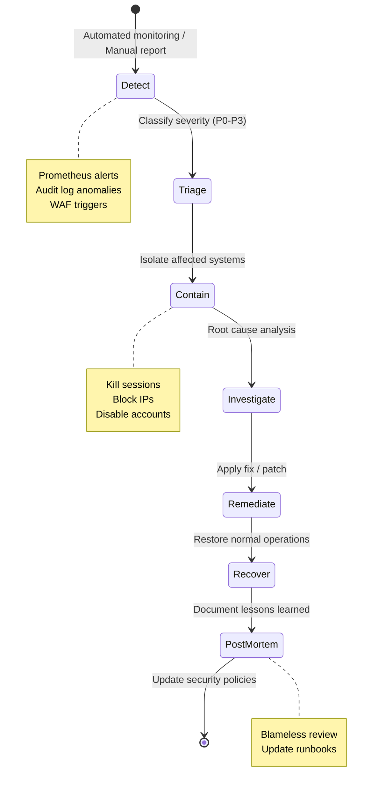

# 🔒 StadiumGenius — Security Architecture

> **Version:** 1.0.0 · **Last Updated:** July 2026  
> **Classification:** Security Design Document  
> **Compliance Targets:** GDPR, FIFA Safety Regulations, OWASP Top 10

---

## 1. Security Overview

StadiumGenius handles safety-critical operations for 82,500+ fans and processes sensitive telemetry from 400+ IoT sensors. Security is designed around a **Zero Trust** model with defense-in-depth across all layers — from edge nodes to cloud services to AI inference.

### Security Principles

| Principle | Description |
|-----------|-------------|
| **Zero Trust** | Never trust, always verify — every request is authenticated and authorized |
| **Defense in Depth** | Multiple security layers; compromise of one layer doesn't expose the system |
| **Least Privilege** | Users and services receive only the minimum permissions required |
| **Fail Secure** | On failure, system defaults to the most restrictive access state |
| **Audit Everything** | Every action, access, and AI interaction is logged immutably |
| **Privacy by Design** | PII minimization, anonymization, and data retention policies built-in |

### Threat Model



---

## 2. Authentication

### 2.1 Authentication Flow



### 2.2 JWT Token Structure

```json
{
  "header": {
    "alg": "RS256",
    "typ": "JWT",
    "kid": "sg-key-2026-07"
  },
  "payload": {
    "sub": "user_uuid",
    "email": "operator@stadiumgenius.io",
    "role": "operator",
    "venue_id": "metlife",
    "permissions": ["dashboard:read", "alerts:read", "ai:query", "incidents:write"],
    "iat": 1720360200,
    "exp": 1720363800,
    "iss": "stadiumgenius-auth",
    "aud": "stadiumgenius-api"
  }
}
```

### 2.3 Authentication Methods

| Method | Use Case | Implementation |
|--------|----------|---------------|
| **JWT Bearer Token** | API requests from dashboard/mobile | RS256-signed, 1-hour expiry |
| **OAuth2 + OIDC** | SSO integration with venue identity providers | Authorization Code flow with PKCE |
| **API Keys** | Service-to-service communication | HMAC-SHA256 with key rotation every 90 days |
| **mTLS** | Internal microservice communication | X.509 certificates via cert-manager |
| **MFA (TOTP)** | Admin and operator login | Time-based one-time passwords (RFC 6238) |

### 2.4 Token Lifecycle

| Token Type | Expiry | Storage | Refresh |
|-----------|--------|---------|---------|
| Access Token (JWT) | 1 hour | httpOnly cookie / memory | Via refresh token |
| Refresh Token | 24 hours | Secure httpOnly cookie | Re-authentication required |
| API Key | 90 days | Server-side vault | Manual rotation |
| WebSocket Token | 4 hours | In-memory | Reconnect with new token |
| Edge Node Token | 30 days | TPM / secure enclave | OTA rotation |

---

## 3. Authorization & RBAC

### 3.1 Role-Based Access Control Model

```mermaid
graph TD
    subgraph Roles["👤 Roles"]
        ADMIN[Admin<br/>Full Access]
        OPERATOR[Operator<br/>Monitoring + AI]
        SECURITY[Security<br/>Safety + CCTV]
        VIEWER[Viewer<br/>Read-Only]
        FAN[Fan<br/>Mobile App]
    end

    subgraph Resources["📦 Resources"]
        DASH[Dashboard]
        TWIN_R[Digital Twin]
        CROWD_R[Crowd Management]
        SEC_R[Security Console]
        AI_R[AI Assistant]
        INC_R[Incidents]
        CONC_R[Concessions]
        CONFIG[System Config]
        USERS_R[User Management]
        AUDIT_R[Audit Logs]
    end

    ADMIN -->|Full CRUD| DASH & TWIN_R & CROWD_R & SEC_R & AI_R & INC_R & CONC_R & CONFIG & USERS_R & AUDIT_R
    OPERATOR -->|Read + AI Query| DASH & TWIN_R & CROWD_R & AI_R
    OPERATOR -->|Read + Write| INC_R & CONC_R
    SECURITY -->|Full Access| SEC_R & INC_R
    SECURITY -->|Read| DASH & TWIN_R
    VIEWER -->|Read Only| DASH & TWIN_R & CROWD_R
    FAN -->|Limited Read| CONC_R

    style Roles fill:#1a1a2e,stroke:#3378ff,color:#fff
    style Resources fill:#1a1a2e,stroke:#f59e0b,color:#fff
```



### 3.2 Permission Matrix

| Permission | Admin | Operator | Security | Viewer | Fan |
|-----------|:-----:|:--------:|:--------:|:------:|:---:|
| `dashboard:read` | ✅ | ✅ | ✅ | ✅ | ❌ |
| `dashboard:write` | ✅ | ❌ | ❌ | ❌ | ❌ |
| `twin:read` | ✅ | ✅ | ✅ | ✅ | ❌ |
| `twin:configure` | ✅ | ❌ | ❌ | ❌ | ❌ |
| `crowd:read` | ✅ | ✅ | ✅ | ✅ | ❌ |
| `crowd:reroute` | ✅ | ✅ | ❌ | ❌ | ❌ |
| `security:read` | ✅ | ❌ | ✅ | ❌ | ❌ |
| `security:cctv` | ✅ | ❌ | ✅ | ❌ | ❌ |
| `security:lockdown` | ✅ | ❌ | ❌ | ❌ | ❌ |
| `incidents:read` | ✅ | ✅ | ✅ | ✅ | ❌ |
| `incidents:write` | ✅ | ✅ | ✅ | ❌ | ❌ |
| `incidents:close` | ✅ | ❌ | ✅ | ❌ | ❌ |
| `ai:query` | ✅ | ✅ | ✅ | ❌ | ❌ |
| `ai:execute_action` | ✅ | ✅ | ❌ | ❌ | ❌ |
| `concessions:read` | ✅ | ✅ | ❌ | ✅ | ✅ |
| `concessions:manage` | ✅ | ❌ | ❌ | ❌ | ❌ |
| `users:manage` | ✅ | ❌ | ❌ | ❌ | ❌ |
| `config:manage` | ✅ | ❌ | ❌ | ❌ | ❌ |
| `audit:read` | ✅ | ❌ | ❌ | ❌ | ❌ |
| `navigation:read` | ✅ | ❌ | ❌ | ❌ | ✅ |

### 3.3 Zone-Based Access Control

Beyond role-based permissions, StadiumGenius enforces **zone-level access** for physical security:

```python
# Zone-based permission check
class ZoneAccess:
    """Operators can only manage resources in their assigned zones."""
    
    ZONE_ASSIGNMENTS = {
        "operator_001": ["zone_a", "zone_b", "zone_c"],
        "operator_002": ["zone_d", "zone_e", "zone_f"],
        "security_lead": ["*"],  # All zones
    }
    
    @staticmethod
    def check_access(user_id: str, zone_id: str) -> bool:
        zones = ZoneAccess.ZONE_ASSIGNMENTS.get(user_id, [])
        return "*" in zones or zone_id in zones
```

---

## 4. Encryption

### 4.1 Encryption Strategy

| Layer | Method | Standard | Key Management |
|-------|--------|----------|---------------|
| **Data in Transit** | TLS 1.3 | HTTPS / WSS | Cert-manager + Let's Encrypt |
| **Data at Rest** | AES-256-GCM | Database encryption | Cloud KMS (Azure Key Vault / AWS KMS) |
| **Service-to-Service** | mTLS | X.509 certificates | Auto-rotated via cert-manager |
| **Edge-to-Cloud** | TLS 1.3 + VPN | IPsec / WireGuard | Pre-shared keys in TPM |
| **Secrets** | AES-256 | Kubernetes Secrets | HashiCorp Vault / Sealed Secrets |
| **Backups** | AES-256-CBC | Encrypted at rest | KMS-managed keys |
| **AI API Keys** | — | Environment variables | Vault with rotation policy |

### 4.2 Certificate Management



---

## 5. Network Security

### 5.1 Network Architecture



### 5.2 Firewall Rules

| Source | Destination | Port | Protocol | Purpose |
|--------|-------------|------|----------|---------|
| Internet | CDN/WAF | 443 | HTTPS | Public web traffic |
| CDN/WAF | API Gateway | 8443 | HTTPS | Filtered traffic |
| API Gateway | Backend | 8000 | HTTP (internal) | API requests |
| API Gateway | WebSocket | 8001 | WS (internal) | Real-time push |
| Backend | PostgreSQL | 5432 | TCP | Database queries |
| Backend | Redis | 6379 | TCP | Cache operations |
| Backend | Neo4j | 7687 | Bolt | Graph queries |
| Backend | Kafka | 9092 | TCP | Event streaming |
| Edge Nodes | MQTT Broker | 8883 | MQTTS | Sensor telemetry |
| MQTT Broker | Kafka | 9092 | TCP | IoT → event bus |

### 5.3 Rate Limiting

| Tier | Requests/min | Burst | WebSocket Connections |
|------|-------------|-------|----------------------|
| Admin | 600 | 100 | 10 |
| Operator | 300 | 50 | 5 |
| Security | 300 | 50 | 5 |
| Fan (Mobile) | 60 | 20 | 1 |
| Service-to-Service | 10,000 | 1,000 | Unlimited |

---

## 6. Audit Logging

### 6.1 Audit Log Schema

Every security-relevant action is logged to the `audit_log` table with immutable write-once semantics:

```sql
CREATE TABLE audit_log (
    id          UUID PRIMARY KEY DEFAULT uuid_generate_v4(),
    timestamp   TIMESTAMPTZ NOT NULL DEFAULT NOW(),
    user_id     UUID REFERENCES users(id),
    action      VARCHAR(100) NOT NULL,
    resource    VARCHAR(100) NOT NULL,
    resource_id VARCHAR(100),
    details     JSONB DEFAULT '{}',
    ip_address  INET,
    user_agent  TEXT,
    outcome     VARCHAR(20) NOT NULL DEFAULT 'success',  -- success, failure, denied
    risk_level  VARCHAR(10) DEFAULT 'low'                 -- low, medium, high, critical
);

CREATE INDEX idx_audit_timestamp ON audit_log(timestamp DESC);
CREATE INDEX idx_audit_user ON audit_log(user_id);
CREATE INDEX idx_audit_action ON audit_log(action);
CREATE INDEX idx_audit_risk ON audit_log(risk_level);
```

### 6.2 Audited Actions

| Category | Actions Logged | Risk Level |
|----------|---------------|------------|
| **Authentication** | Login, logout, failed login, token refresh, MFA challenge | Medium |
| **Authorization** | Permission denied, role change, privilege escalation | High |
| **Data Access** | CCTV feed access, incident report view, PII access | Medium |
| **AI Operations** | AI query, recommendation generated, action approved/rejected | Medium |
| **System Config** | Settings change, user creation/deletion, role modification | High |
| **Incident Management** | Incident created, escalated, resolved, lockdown triggered | Critical |
| **Edge Operations** | Edge node connected, firmware update, model deployment | Medium |
| **Data Export** | Report downloaded, data exported, backup created | High |

### 6.3 Audit Log Retention

| Log Type | Retention | Archive |
|----------|-----------|---------|
| Security events | 365 days (active) | 7 years (cold storage) |
| AI interactions | 90 days (active) | 2 years (cold storage) |
| Access logs | 30 days (active) | 1 year (cold storage) |
| System events | 30 days (active) | 90 days (cold storage) |

---

## 7. Data Privacy & GDPR Compliance

### 7.1 Data Classification

| Classification | Examples | Handling |
|---------------|----------|----------|
| **Public** | Stadium layout, gate names, weather | No restrictions |
| **Internal** | Operational metrics, KPIs, trends | Role-based access |
| **Confidential** | Incident reports, AI logs, security footage | Encrypted + RBAC |
| **Restricted** | Fan PII (names, tickets), biometric data | Anonymized + encrypted + audit |

### 7.2 PII Handling



### 7.3 Privacy Controls

| Control | Implementation | GDPR Article |
|---------|---------------|-------------|
| **Data Minimization** | Collect only venue_id, zone_code — no fan names in telemetry | Art. 5(1)(c) |
| **Purpose Limitation** | Data used only for stadium operations, not marketing | Art. 5(1)(b) |
| **Anonymization** | Fan counts aggregated per zone; no individual tracking | Art. 4(5) |
| **Right to Erasure** | API endpoint to delete user data on request | Art. 17 |
| **Data Portability** | Export user data in JSON/CSV format | Art. 20 |
| **Breach Notification** | Automated alerting within 72 hours of detected breach | Art. 33 |
| **DPO Contact** | Designated data protection officer for all venues | Art. 37 |
| **Consent Management** | Opt-in for mobile app location tracking, push notifications | Art. 7 |

### 7.4 CCTV & Surveillance Privacy

| Requirement | Implementation |
|-------------|---------------|
| Signage | Clear "CCTV in operation" signage at all monitored areas |
| Purpose | Safety and crowd management only — no facial recognition in MVP |
| Retention | Raw footage: 72 hours. AI-processed events: 30 days. |
| Access | Security role only. All access logged in audit trail. |
| No facial recognition | MVP uses YOLOv8 person detection (bounding boxes only) |
| Data subject rights | Fans can request footage review via venue management |

---

## 8. AI Safety & Security

### 8.1 AI Threat Model

| Threat | Risk | Mitigation |
|--------|------|------------|
| **Prompt Injection** | Attacker manipulates AI to bypass safety controls | Input sanitization + topic boundary enforcement |
| **Data Poisoning** | Corrupted training data leads to wrong predictions | Validated training datasets + anomaly detection on inputs |
| **PII Leakage** | AI accidentally reveals fan personal data | PII filter on all inputs/outputs + no PII in RAG corpus |
| **Hallucination** | AI generates false crowd density or safety claims | Factual grounding against live twin data + confidence thresholds |
| **Autonomous Actions** | AI executes dangerous actions without approval | Human-in-the-loop for ALL physical actions (gate control, PA, dispatch) |
| **Model Theft** | Edge models stolen from compromised nodes | Model encryption + signed firmware + TPM attestation |

### 8.2 AI Guardrails Architecture

```mermaid
graph LR
    subgraph Input["🛡️ Input Layer"]
        I1[PII Redaction]
        I2[Injection Detection]
        I3[Topic Boundaries]
        I4[Rate Limiting]
    end

    subgraph Inference["🤖 Inference"]
        LLM_S[LLM Inference<br/>GPT-4o / Llama 3]
    end

    subgraph Output["🛡️ Output Layer"]
        O1[PII Filter]
        O2[Factual Grounding]
        O3[Safety Validator]
        O4[Confidence Check]
    end

    subgraph Action["👤 Human Loop"]
        H1[Operator Review]
        H2[Approval Required]
        H3[Audit Logged]
    end

    Input --> Inference --> Output --> Action
```



### 8.3 Safety Classification

| Action Category | Approval Required | Automated Allowed |
|----------------|:-----------------:|:-----------------:|
| Information queries (crowd status, weather) | ❌ | ✅ |
| Report generation | ❌ | ✅ |
| Alert notifications | ❌ | ✅ |
| Gate control (open/close) | ✅ Operator | ❌ |
| Fan push notifications | ✅ Operator | ❌ |
| Crowd rerouting | ✅ Operator | ❌ |
| Staff dispatch | ✅ Operator | ❌ |
| PA system announcements | ✅ Operator | ❌ |
| Evacuation trigger | ✅ Admin + Security | ❌ |
| Venue lockdown | ✅ Admin only | ❌ |

---

## 9. Incident Response Plan

### 9.1 Security Incident Classification

| Severity | Examples | Response Time | Escalation |
|----------|----------|--------------|------------|
| **P0 — Critical** | System breach, data exfiltration, lockdown bypass | < 5 min | Immediate: CTO + Security Lead |
| **P1 — High** | Failed auth spike, edge node compromise, AI safety bypass | < 15 min | Security Lead + Ops Manager |
| **P2 — Medium** | Unusual access patterns, rate limit abuse, config change | < 1 hour | Security Team |
| **P3 — Low** | Failed login attempts, minor policy violations | < 24 hours | Automated logging |

### 9.2 Incident Response Flow



---

## 10. Compliance Checklist

| Requirement | Status | Notes |
|-------------|:------:|-------|
| TLS 1.3 on all endpoints | ✅ | cert-manager with auto-renewal |
| JWT authentication with RS256 | ✅ | 1-hour token expiry |
| RBAC with 5 roles | ✅ | Admin, Operator, Security, Viewer, Fan |
| Password hashing (bcrypt) | ✅ | Cost factor 12, salted |
| MFA for admin/operator | ✅ | TOTP (RFC 6238) |
| mTLS for internal services | ✅ | X.509 via cert-manager |
| Encryption at rest (AES-256) | ✅ | Cloud KMS managed |
| Audit logging | ✅ | All security actions logged |
| PII anonymization | ✅ | No fan PII in telemetry |
| Rate limiting | ✅ | Per-role limits enforced |
| WAF enabled | ✅ | OWASP Core Rule Set |
| Dependency scanning | ✅ | Dependabot + Snyk |
| Container image signing | ✅ | Cosign / Notary |
| Secrets management | ✅ | Vault / Kubernetes Secrets |
| GDPR compliance | ✅ | Data minimization, retention policies |
| Breach notification process | ✅ | < 72 hour notification pipeline |
| Security incident runbooks | ✅ | P0-P3 response procedures |
| No facial recognition (MVP) | ✅ | Bounding box detection only |
| AI human-in-the-loop | ✅ | All physical actions require approval |

---

*Next: [Testing →](testing.md) · [Architecture →](architecture.md) · [AI Workflows →](ai-workflows.md)*
