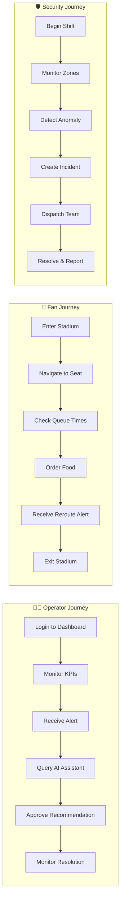

# 👤 StadiumGenius — User Stories

> **Version:** 1.0.0 · **Last Updated:** July 2026  
> **Methodology:** Agile / Scrum · **Sprint Length:** 2 weeks  
> **Personas:** Stadium Operator, Security Officer, Fan, System Admin, AI System

---

## 1. Persona Definitions

### 1.1 Personas

| Persona | Description | Primary Goals |
|---------|-------------|---------------|
| **🧑‍💼 Stadium Operator** | Control room staff monitoring live stadium operations | Real-time visibility, quick decision-making, AI-assisted insights |
| **🛡️ Security Officer** | On-ground and control room security personnel | Threat detection, incident management, patrol coordination |
| **🎉 Fan** | Match attendee using the mobile app (80,000+ per match) | Navigation, queue info, personalized experience, safety |
| **⚙️ System Admin** | IT administrator managing the StadiumGenius platform | User management, system configuration, monitoring |
| **🤖 AI System** | The StadiumGenius AI subsystem (non-human actor) | Accurate predictions, safe recommendations, grounded responses |

### 1.2 Persona Journey Map

---

## 2. Stadium Operator Stories

### Epic: Real-Time Dashboard Monitoring

**US-OP-001: View Live Dashboard KPIs**
> As a **Stadium Operator**, I want to view a live dashboard with key performance indicators, so that I can monitor overall stadium health at a glance.

| Field | Detail |
|-------|--------|
| Priority | 🔴 P0 — Critical |
| Sprint | Sprint 4 |
| Status | ✅ Done |
| Story Points | 5 |

**Acceptance Criteria:**
- [ ] Dashboard displays 8 KPI cards: Total Fans, Avg Queue Time, Incidents Resolved, Active Alerts, Fan Satisfaction, Edge Node Uptime, Security Events, Transport Capacity
- [ ] KPI values update every 5 seconds via WebSocket
- [ ] KPI cards show trend indicators (up/down arrows with percentage change)
- [ ] Color-coded severity: green (normal), yellow (warning), red (critical)
- [ ] Dashboard loads within 2 seconds

---

**US-OP-002: View Crowd Density Heatmap**
> As a **Stadium Operator**, I want to see a real-time crowd density heatmap overlaid on the stadium layout, so that I can identify congestion hotspots immediately.

| Field | Detail |
|-------|--------|
| Priority | 🔴 P0 — Critical |
| Sprint | Sprint 5 |
| Status | ✅ Done |
| Story Points | 8 |

**Acceptance Criteria:**
- [ ] Heatmap displays a 12×16 grid with color-coded density levels
- [ ] Colors range from green (< 2.0 p/m²) → yellow (2.0–3.5) → red (> 3.5)
- [ ] Heatmap updates every 3 seconds
- [ ] Clicking a zone shows detailed zone metrics (occupancy, capacity, trend)
- [ ] Heatmap supports layer switching: density, security, environmental, infrastructure

---

**US-OP-003: Receive and Manage Alerts**
> As a **Stadium Operator**, I want to receive real-time alerts when thresholds are breached, so that I can respond to issues before they escalate.

| Field | Detail |
|-------|--------|
| Priority | 🔴 P0 — Critical |
| Sprint | Sprint 5 |
| Status | ✅ Done |
| Story Points | 5 |

**Acceptance Criteria:**
- [ ] Alerts appear in the alert feed with severity badge (info, warning, critical)
- [ ] Critical alerts trigger audio notification and visual flash
- [ ] Operator can acknowledge alerts (removes from active list)
- [ ] Operator can dismiss resolved alerts
- [ ] Alert history is searchable and filterable by severity and type
- [ ] Maximum 30-second delay from event to alert display

---

**US-OP-004: Monitor Gate Throughput**
> As a **Stadium Operator**, I want to monitor gate throughput and queue lengths in real-time, so that I can identify bottlenecks and activate overflow gates.

| Field | Detail |
|-------|--------|
| Priority | 🟡 P1 — High |
| Sprint | Sprint 6 |
| Status | ✅ Done |
| Story Points | 5 |

**Acceptance Criteria:**
- [ ] Gate status display shows throughput (fans/min), queue length, average wait time
- [ ] Visual indicators: green (flowing), yellow (building), red (congested)
- [ ] Gate status updates every 5 seconds
- [ ] Historical throughput chart shows last 2 hours of gate activity
- [ ] Alert triggered when any gate queue exceeds 100 people

---

### Epic: AI-Assisted Operations

**US-OP-005: Query AI Operations Assistant**
> As a **Stadium Operator**, I want to ask natural-language questions to an AI assistant connected to the live stadium data, so that I can get instant analysis and recommendations.

| Field | Detail |
|-------|--------|
| Priority | 🔴 P0 — Critical |
| Sprint | Sprint 8 |
| Status | ✅ Done |
| Story Points | 8 |

**Acceptance Criteria:**
- [ ] Chat interface accepts free-text queries
- [ ] AI responds within 3 seconds with data-grounded analysis
- [ ] Response includes confidence score and data sources cited
- [ ] AI can suggest actionable recommendations (e.g., "Open Gate C overflow")
- [ ] Quick-prompt buttons for common queries (crowd status, predictions, incidents)
- [ ] Conversation history persisted per session
- [ ] AI never executes physical actions without operator approval

---

**US-OP-006: Approve AI Recommendations**
> As a **Stadium Operator**, I want to review and approve/reject AI-generated recommendations before they are executed, so that human judgment remains in the loop for all physical actions.

| Field | Detail |
|-------|--------|
| Priority | 🔴 P0 — Critical |
| Sprint | Sprint 9 |
| Status | 📝 Planned |
| Story Points | 5 |

**Acceptance Criteria:**
- [ ] AI recommendations display with "Approve" and "Reject" buttons
- [ ] Recommendation shows: action, target, expected impact, confidence score
- [ ] Approved actions are executed and logged in audit trail
- [ ] Rejected actions are logged with operator's reason
- [ ] Safety-critical actions (evacuation, lockdown) require Admin + Security approval
- [ ] All approval decisions are immutably logged

---

**US-OP-007: View AI-Generated Predictions**
> As a **Stadium Operator**, I want to see AI-predicted crowd density for the next 60 minutes, so that I can proactively manage resources before issues arise.

| Field | Detail |
|-------|--------|
| Priority | 🟡 P1 — High |
| Sprint | Sprint 9 |
| Status | 📝 Planned |
| Story Points | 5 |

**Acceptance Criteria:**
- [ ] Prediction chart shows 5-min, 15-min, 30-min, 60-min forecasts
- [ ] Each prediction includes confidence interval (e.g., 91% ± 3%)
- [ ] Predictions include recommended actions when thresholds likely exceeded
- [ ] Historical accuracy of predictions visible (last 5 matches)
- [ ] Predictions refresh every 60 seconds

---

## 3. Security Officer Stories

### Epic: Security Monitoring & Incident Management

**US-SEC-001: Monitor Security Zones**
> As a **Security Officer**, I want to view all security zones with their current status, so that I can identify areas needing attention.

| Field | Detail |
|-------|--------|
| Priority | 🔴 P0 — Critical |
| Sprint | Sprint 6 |
| Status | ✅ Done |
| Story Points | 5 |

**Acceptance Criteria:**
- [ ] Zone map displays all security zones with color-coded status (green/yellow/red)
- [ ] Each zone shows: camera count, active alerts, patrol status, last sweep time
- [ ] Zone status updates in real-time (< 5 second delay)
- [ ] Clicking a zone shows detailed view with camera feeds and activity log

---

**US-SEC-002: Manage Incidents**
> As a **Security Officer**, I want to create, track, and resolve security incidents, so that all events are documented and response times are optimized.

| Field | Detail |
|-------|--------|
| Priority | 🔴 P0 — Critical |
| Sprint | Sprint 7 |
| Status | ✅ Done |
| Story Points | 8 |

**Acceptance Criteria:**
- [ ] Create incident with: type, zone, priority (critical/high/medium/low), description
- [ ] Incident automatically assigned to nearest available security team
- [ ] Incident timeline shows all status changes with timestamps
- [ ] Response time tracked from creation to first update
- [ ] Incident can be escalated, resolved, or closed
- [ ] Resolved incidents generate summary report (AI-assisted)
- [ ] Incident list filterable by status, priority, zone, and date range

---

**US-SEC-003: View CCTV Feeds with AI Annotations**
> As a **Security Officer**, I want to view CCTV camera feeds with AI-detected anomalies highlighted, so that I can quickly spot potential security issues.

| Field | Detail |
|-------|--------|
| Priority | 🟡 P1 — High |
| Sprint | Sprint 7 |
| Status | ✅ Done |
| Story Points | 8 |

**Acceptance Criteria:**
- [ ] Camera grid displays feeds from all 128 cameras (4×4 default, expandable)
- [ ] AI anomaly detections highlighted with bounding boxes and labels
- [ ] Anomaly types: crowd clustering, restricted area entry, abandoned object, fight
- [ ] Click on camera feed to expand to full screen
- [ ] Camera search/filter by zone, status, anomaly type
- [ ] No facial recognition — bounding boxes only (privacy compliance)

---

**US-SEC-004: Manage Evacuation Routes**
> As a **Security Officer**, I want to view and manage evacuation routes with real-time capacity data, so that I can ensure safe egress during emergencies.

| Field | Detail |
|-------|--------|
| Priority | 🟡 P1 — High |
| Sprint | Sprint 7 |
| Status | ✅ Done |
| Story Points | 5 |

**Acceptance Criteria:**
- [ ] Evacuation route map shows all exit paths with current capacity utilization
- [ ] Routes color-coded: green (clear), yellow (moderate), red (congested)
- [ ] Each route shows: exit gate, estimated evacuation time, current flow rate
- [ ] Routes can be marked as blocked/compromised
- [ ] AI recommends optimal evacuation routing based on current crowd distribution

---

**US-SEC-005: Track Security Patrols**
> As a **Security Officer**, I want to see real-time locations and routes of all security patrol teams, so that I can coordinate coverage and response.

| Field | Detail |
|-------|--------|
| Priority | 🟢 P2 — Medium |
| Sprint | Sprint 7 |
| Status | ✅ Done |
| Story Points | 3 |

**Acceptance Criteria:**
- [ ] Patrol map shows current position of each security team
- [ ] Patrol routes visible with checkpoint status (completed/pending)
- [ ] Nearest team auto-identified for incident dispatch
- [ ] Patrol schedule and history accessible

---

## 4. Fan Stories

### Epic: Fan Experience & Navigation

**US-FAN-001: Navigate to Seat**
> As a **Fan**, I want to get optimal walking directions from my entry gate to my seat, so that I can reach my seat quickly and easily.

| Field | Detail |
|-------|--------|
| Priority | 🟡 P1 — High |
| Sprint | Sprint 11 |
| Status | 📝 Planned |
| Story Points | 5 |

**Acceptance Criteria:**
- [ ] Enter gate and seat number to get step-by-step directions
- [ ] Multiple route options: fastest, least crowded, accessible
- [ ] Route considers real-time corridor density (avoids congested paths)
- [ ] Estimated walking time displayed for each route
- [ ] Accessible route option for wheelchair users (elevators, ramps)
- [ ] Navigation response within 1 second

---

**US-FAN-002: Check Concession Queue Times**
> As a **Fan**, I want to see real-time queue lengths and wait times at nearby concession stands, so that I can choose the shortest queue.

| Field | Detail |
|-------|--------|
| Priority | 🟡 P1 — High |
| Sprint | Sprint 11 |
| Status | 📝 Planned |
| Story Points | 3 |

**Acceptance Criteria:**
- [ ] List of nearby concession stands with current queue length and estimated wait time
- [ ] Stands sortable by wait time, distance, and type (food/drink)
- [ ] Color-coded wait times: green (< 3 min), yellow (3–8 min), red (> 8 min)
- [ ] Queue data updates every 30 seconds

---

**US-FAN-003: Receive Rerouting Notifications**
> As a **Fan**, I want to receive push notifications when a rerouting event affects my area, so that I can follow an alternative path and avoid congestion.

| Field | Detail |
|-------|--------|
| Priority | 🟡 P1 — High |
| Sprint | Sprint 11 |
| Status | 📝 Planned |
| Story Points | 3 |

**Acceptance Criteria:**
- [ ] Push notification sent when rerouting activated near fan's current zone
- [ ] Notification includes: reason, alternative route, estimated impact
- [ ] Notification links to updated navigation with new route
- [ ] Fan can dismiss notification
- [ ] Notifications only sent to fans in affected zones (not stadium-wide spam)

---

**US-FAN-004: View Personalized Offers**
> As a **Fan**, I want to receive personalized offers and vouchers based on my location in the stadium, so that I get relevant deals nearby.

| Field | Detail |
|-------|--------|
| Priority | 🟢 P2 — Medium |
| Sprint | Sprint 12 |
| Status | 📝 Planned |
| Story Points | 3 |

**Acceptance Criteria:**
- [ ] Location-aware offers shown for nearby concessions
- [ ] Offers include: discount percentage, stand name, distance, valid time
- [ ] Offers respect user's opt-in consent preferences
- [ ] No PII shared with third-party concession operators

---

**US-FAN-005: Emergency Evacuation Guidance**
> As a **Fan**, I want to receive clear evacuation instructions on my mobile device during an emergency, so that I can reach the nearest exit safely.

| Field | Detail |
|-------|--------|
| Priority | 🔴 P0 — Critical |
| Sprint | Sprint 11 |
| Status | 📝 Planned |
| Story Points | 5 |

**Acceptance Criteria:**
- [ ] Emergency push notification with evacuation instructions
- [ ] Map shows nearest exit with step-by-step walking directions
- [ ] Route avoids blocked or congested exits (real-time update)
- [ ] Accessible routes highlighted for users who opted in
- [ ] Works offline (cached stadium map) if network fails
- [ ] Available in 10+ languages

---

## 5. System Admin Stories

### Epic: System Administration

**US-ADM-001: Manage User Accounts**
> As a **System Admin**, I want to create, edit, and deactivate user accounts with role assignments, so that I can control who has access to the platform.

| Field | Detail |
|-------|--------|
| Priority | 🟡 P1 — High |
| Sprint | Sprint 10 |
| Status | 📝 Planned |
| Story Points | 5 |

**Acceptance Criteria:**
- [ ] Create new user with: name, email, role (Admin/Operator/Security/Viewer), venue assignment
- [ ] Edit existing user's role, venue, and active status
- [ ] Deactivate user (revokes all tokens immediately)
- [ ] Password reset flow with email verification
- [ ] User list with search, filter by role, and sort by last login
- [ ] All user management actions logged in audit trail

---

**US-ADM-002: Configure System Settings**
> As a **System Admin**, I want to configure system-wide settings like alert thresholds, refresh intervals, and AI parameters, so that the platform is tuned for the specific venue.

| Field | Detail |
|-------|--------|
| Priority | 🟢 P2 — Medium |
| Sprint | Sprint 10 |
| Status | 📝 Planned |
| Story Points | 5 |

**Acceptance Criteria:**
- [ ] Configure crowd density thresholds per zone (warning, critical)
- [ ] Set dashboard refresh interval (1s–30s)
- [ ] Configure AI model parameters (temperature, max tokens, confidence threshold)
- [ ] Enable/disable specific alert types
- [ ] Settings changes take effect immediately without restart
- [ ] Settings history with rollback capability

---

**US-ADM-003: View Audit Logs**
> As a **System Admin**, I want to view comprehensive audit logs of all system actions, so that I can investigate security events and ensure compliance.

| Field | Detail |
|-------|--------|
| Priority | 🟡 P1 — High |
| Sprint | Sprint 10 |
| Status | 📝 Planned |
| Story Points | 3 |

**Acceptance Criteria:**
- [ ] Audit log table with: timestamp, user, action, resource, outcome, risk level
- [ ] Filterable by user, action type, date range, and risk level
- [ ] Export to CSV/JSON for compliance reporting
- [ ] Logs are immutable (cannot be modified or deleted)
- [ ] 365-day retention for security events

---

**US-ADM-004: Monitor System Health**
> As a **System Admin**, I want to view system health metrics including service status, edge node connectivity, and database performance, so that I can ensure platform reliability.

| Field | Detail |
|-------|--------|
| Priority | 🟡 P1 — High |
| Sprint | Sprint 10 |
| Status | 📝 Planned |
| Story Points | 5 |

**Acceptance Criteria:**
- [ ] Health dashboard shows: all microservice statuses, database connections, Kafka lag
- [ ] Edge node grid with connectivity status (47 nodes, online/offline/degraded)
- [ ] Alerting when any service goes unhealthy (< 60 seconds detection)
- [ ] CPU, memory, and disk usage for all pods
- [ ] Integration with Grafana dashboards for deep-dive metrics

---

## 6. AI System Stories (Non-Human Actor)

### Epic: AI Safety & Intelligence

**US-AI-001: Ground Responses in Live Data**
> As the **AI System**, I must ground all responses in live Digital Twin data, so that operators receive accurate, trustworthy information.

| Field | Detail |
|-------|--------|
| Priority | 🔴 P0 — Critical |
| Sprint | Sprint 8 |
| Status | 📝 Planned |
| Story Points | 8 |

**Acceptance Criteria:**
- [ ] All numerical claims (density, occupancy, throughput) sourced from Digital Twin
- [ ] Response includes `sources` field listing data origins
- [ ] Confidence score below 85% triggers disclaimer
- [ ] When data unavailable, AI states "data unavailable" — never fabricates
- [ ] Response timestamp matches within 10 seconds of latest Twin state

---

**US-AI-002: Block Prompt Injection Attacks**
> As the **AI System**, I must detect and block prompt injection attempts, so that the system cannot be manipulated to bypass safety controls.

| Field | Detail |
|-------|--------|
| Priority | 🔴 P0 — Critical |
| Sprint | Sprint 9 |
| Status | 📝 Planned |
| Story Points | 5 |

**Acceptance Criteria:**
- [ ] Detect and block "ignore previous instructions" patterns
- [ ] Detect and block system prompt override attempts
- [ ] Detect and block encoded/obfuscated injection payloads
- [ ] All blocked attempts logged with full content for security review
- [ ] 0% bypass rate on known injection test suite (50+ patterns)
- [ ] Legitimate queries with similar phrasing are not falsely blocked

---

**US-AI-003: Enforce Human-in-the-Loop**
> As the **AI System**, I must never autonomously execute physical actions, so that human operators maintain control over all safety-critical decisions.

| Field | Detail |
|-------|--------|
| Priority | 🔴 P0 — Critical |
| Sprint | Sprint 9 |
| Status | 📝 Planned |
| Story Points | 5 |

**Acceptance Criteria:**
- [ ] All gate control, PA announcement, dispatch, and notification actions flagged as `requires_approval: true`
- [ ] Evacuation and lockdown actions require Admin + Security dual approval
- [ ] `max_autonomous_actions: 0` enforced in production configuration
- [ ] AI can only display information and suggest — never execute
- [ ] Audit log records every recommendation and approval/rejection decision

---

**US-AI-004: Protect Fan Privacy**
> As the **AI System**, I must never expose personally identifiable information (PII) in responses, so that fan privacy is protected.

| Field | Detail |
|-------|--------|
| Priority | 🔴 P0 — Critical |
| Sprint | Sprint 9 |
| Status | 📝 Planned |
| Story Points | 3 |

**Acceptance Criteria:**
- [ ] PII filter applied to all inputs and outputs (names, ticket IDs, phone numbers)
- [ ] PII automatically redacted and replaced with tokens (e.g., `[REDACTED_NAME]`)
- [ ] No PII stored in AI conversation logs
- [ ] No PII included in RAG corpus or training data
- [ ] 0% PII leak rate on automated test suite

---

## 7. Story Summary

### By Status

| Status | Count | Story Points |
|--------|:-----:|:-----------:|
| ✅ Done | 12 | 68 |
| 📝 Planned | 14 | 69 |
| **Total** | **26** | **137** |

### By Persona

| Persona | Stories | Story Points |
|---------|:------:|:-----------:|
| 🧑‍💼 Operator | 7 | 41 |
| 🛡️ Security | 5 | 29 |
| 🎉 Fan | 5 | 19 |
| ⚙️ Admin | 4 | 18 |
| 🤖 AI System | 4 | 21 |
| **Total** | **25** | **128** |

### By Priority

| Priority | Stories | Rationale |
|----------|:------:|-----------|
| 🔴 P0 — Critical | 12 | Safety, core functionality, AI safety |
| 🟡 P1 — High | 9 | Important features, security monitoring |
| 🟢 P2 — Medium | 4 | Nice-to-have, admin tools |

---

*Next: [MVP Roadmap →](mvp-roadmap.md) · [Architecture →](architecture.md) · [Testing →](testing.md)*
